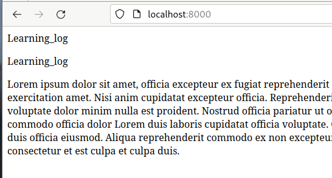

# Django 入门

Django 是一个 Web 框架，一套用于帮助开发交互式网站的工具。Django 能相应网页请求，还能轻松读写数据库、管理用户等

## 建立项目

我们要编写一个名为 《学习笔记》的 Web 应用程序，让用户能记录感兴趣的主题，并在学习每个主题的过程中添加日志条目。”学习笔记“ 的主页对这个网站进行描述，并邀请用户注册或登陆。用户登陆后，就可创建新主题、添加条目以及阅读既有条目

### 建立虚拟环境

使用 Django 前，先建立一个虚拟工作环境。虚拟环境是系统的一个位置，可以在其中安装包，并将其与其他 Python 包隔离。

将项目的库与其他项目分离是有益的，且为了后续将”学习笔记“部署到服务器，这也是必须的

为项目新建一个目录，将其命令为 `learning_log`，再在终端中进入这个目录，并创建一个虚拟环境， python3 可用下行命令创建虚拟环境

```py
> python -m venv ll_env
```

这里运行了模块 venv，并用它来创建爱你一个名为 ll_env 的虚拟环境

#### 激活虚拟环境

建立虚拟环境后，需要使用下面的命令激活它

```py
learning_log$ source ll_env/bin/activate
(ll_env)learning_log$
```

> 这个命令运行 ll_env/bin/activate 脚本，环境处于活动状态时，环境名将包含在括号内。这种情况下，可以在环境中安装包，并使用已安装的包。在 ll_env 中安装的包仅在该环境处于活动状态时才可用

要停止使用虚拟环境，可执行命令

```py
(ll_env)learning_log$ deactiviate
learning_log$
```

#### 安装 Django

激活虚拟环境后，可通过 pip 安装 Django

```py
(ll_env)learning_log$ pip install Django
```

由于我们是在虚拟环境中工作，因此在所有的系统中，安装 Django 的命令都相同：不需要指定标志 --user,也无需使用 `python -m pip install package_name` 这种较长的命令

> Django 目前仅在虚拟环境处于活动状态时才可用

#### 在 Django 中创建项目

在依然处于活动的虚拟环境的情况下，执行下面的命令来新建一个项目

```sh
> django-admin startproject learning_log .
> l
total 12K
drwxr-xr-x 2 qinghuo qinghuo 4.0K May 22 16:57 learning_log
drwxr-xr-x 5 qinghuo qinghuo 4.0K May 22 16:42 ll_env
-rwxr-xr-x 1 qinghuo qinghuo  668 May 22 16:57 manage.py
> ls learning_log
asgi.py  __init__.py  settings.py  urls.py  wsgi.py

~/Desktop/py/zeroToOne/project/learning_log                py ll_env
```

`manage.py` 文件是一个简单的程序，它接受命令并将其交给 Django 的相关部分去运行。我们将使用这些命令来管理诸如使用数据库和运行服务器等任务

`settings.py` 指定 Django 如何与我们的系统交互以及如何管理项目

`urls.py` 告诉 Django 应创建哪些网页来相应浏览器请求

`wsgi.py` 文件帮助 Django 提供它创建的文件，这个文件名是 *Web Server Gateway Interface* (Web服务器网关接口)的首字母缩写

#### 创建数据库

Django 将大部分与项目相关的信息都存储在数据库中，因此我们需要创建一个供 Django 使用的数据库。

为给项目 “学习笔记” 创建数据库，需要在虚拟环境中执行下行命令

```sh
> python manage.py migrate
Operations to perform:
  Apply all migrations: admin, auth, contenttypes, sessions
Running migrations:
  Applying contenttypes.0001_initial... OK
  Applying auth.0001_initial... OK
  Applying admin.0001_initial... OK
--snip--

> ls
learning_log  ll_env  db.sqlite3  manage.py
```

我们将修改数据库称为`迁移数据库`。首次执行命令 `migrate` 时，将让 Django 确保数据库与项目的当前状态匹配。在使用 `SQLite` 的新项目中首次执行这个命令时，Django 将新建一个数据库。

> 通过 ls 命令，其输出表明 Django 又创建了一个文件 `db.sqlite3`。`SQLite` 是一种使用单个文件的数据库，是编写简单App 的理想选择，因为它让你不太关注数据库管理的问题

#### 查看项目

下面来合适 Django 是否正确地创建了项目。可执行命令 `runserver`

```sh
> python manage.py runserver
Watching for file changes with StatReloader
Performing system checks...

System check identified no issues (0 silenced).
May 22, 2023 - 09:09:41
Django version 4.2.1, using settings 'learning_log.settings'
Starting development server at http://127.0.0.1:8000/
Quit the server with CONTROL-C.
```

Django 启动一个服务器，让我们能看到系统中的项目，了解它们的工作情况。当我们在浏览器中输入 URL 以请求网页时，该 Django 服务器将进行相应

生成合适的网页，并将其发送给浏览器。

 

### 创建应用程序

Django 项目由一些列应用程序组成，它们协同工作，让项目成为一个整体。

我们暂时只创建一个应用程序，它将完成项目的大部分工作。

当前，在前面打开的终端窗口中应该还运行着 runserver 。再打开一个终端，并切换到 `manage.py` 所在的目录。激活该虚拟环境，再执行命令 `startapp`

```sh
> python manage.py startapp learning_logs
> ls
learning_log  learning_logs  ll_env  db.sqlite3  manage.py
> ls learning_logs
migrations  admin.py  apps.py  __init__.py  models.py  tests.py  views.py
```

命令 `startapp Appname` 让 Django 建立创建应用程序所需的基础设施。

现在查看项目目录，会发现新增了一个文件夹 `learning_logs`。打开该文件夹，看看 Django 创建了什么

其中最重要的文件是 `models.py, admin.py 和 views.py`。我们将使用 `models.py` 来定义我们要在应用程序中管理的数据

#### 定义模型

我们想一下要涉及的数据。美味用户都需要在学习笔记中创建很多主题。用户输入的每个条目斗鱼特定主题相关联，这些条目将以文本的方式显示。

我们还需要存储每个条目的时间戳，以便能够告诉用户各个条目都是什么时候创建的

models.py 的默认内容如下

```py
> cat learning_logs/models.py
from django.db import models
# Create your models here.
```

这里导入了模块 `models`，还让我们创建自己的模型。

> 模型告诉 Django 如何处理应用程序中存储的数据。在代码层面，模型就是一个类，包含属性和方法。

下面是表示用户将要存储的主题的模型

```py
> cat learning_logs/models.py
from django.db import models
# Create your models here.
class Topic(models.Model):
    """用户学习的主题"""
    text = models.CharField(max_length=200)
    date_added = models.DateTimeField(auto_now_add=True)

    def __str__(self):
        """返回模型的字符串表示"""
        return self.text
```

创建一个名为 `Topic` 的类，它继承了 `Model`————Django 中一个定义了模型基本功能的类。Topic 类只有两个属性，text 和 date_added

属性`text`是一个`CharField`————由字符或文本组成的数据。需要存储少量的文本，如名称、标题或城市时，可使用`CharField`。定义`CharField`属性时，必须告诉 Django 在数据库中预留多少空间。在这里，我们将`max_length`设置为200(即200个字符)，这对存储大多主题名来说足够了

属性`date_added`是一个`DateTimeField`————记录日期和时间的数据。我们传递了实参`auto_now_add=True`，每当用户创建新主题时，这都让 Django 将这个属性自动设置成当前日期和时间

> 要获悉可在模型中使用的各种字段，需参阅 Django Model Field Reference (Django 模型字段参考)

我们需要告诉 Django,默认应使用哪个属性来显示有关主题的信息。Django 调用方法 __str__()来显示模型的简单表示

#### 激活模型

要使用模型，必须让 Django 将应用程序包含到项目中。为此，打开 `settings.py`

```py
> cat learning_log/settings
# Application definition
INSTALLED_APPS = [
    'django.contrib.admin',
    'django.contrib.auth',
    'django.contrib.contenttypes',
    'django.contrib.sessions',
    'django.contrib.messages',
    'django.contrib.staticfiles',
    # 我的应用程序
    'learning_logs',
]
```

`INSTALLED_APPS`是一个列表，它告诉 Django 项目是由哪些 app 组成的。在这里将应用程序编组，在项目不断增大，包含更多的应用程序时，有助于对应用程序进行跟踪。

下面需要让 Django 修改数据库，使其能够存储与模型 Topic 相关的信息。需在终端执行下行命令

```sh
> python manage.py makemigrations learning_logs
Migrations for 'learning_logs':
  learning_logs/migrations/0001_initial.py
    - Create model Topic
```

命令`makemigrations`让 Django 确定该如何修改数据库，使其能存储与我们定义的新模型相关联的数据。输出表明 Django 创建了一个名为 `0001_initial.py` 的迁移文件，这个文件将在数据库中为模型 Topic 创建一个表

下面应用这种迁移，让 Django 替我们修改数据库

```sh
> python manage.py migrate
Operations to perform:
  Apply all migrations: admin, auth, contenttypes, learning_logs, sessions
Running migrations:
  Applying learning_logs.0001_initial... OK
```

这个命令的大部分输出与我们首次执行 `migrate` 的输出相同。在这里，Django 确认为 `learning_logs` 应用迁移时一切正常

- 每次需要修改 “学习笔记“ 管理的数据时，都采取如下三个步骤：
    1. 修改 models.py
    2. 对 learning_logs 调用 makemigrations
    3. 让 Django 迁移项目

#### Django 管理网站

为应用程序定义模型时，Django 提供的管理网站(admin site) 让我们轻松地处理模型。

##### 定义超级用户

Django 允许我们创建超级用户。权限决定了用户可执行的操作

为 Django 中创建超级用户，需执行下行命令

```sh
> python manage.py createsuperuser
Username (leave blank to use 'qinghuo'): ll_admin
Email address: #电子邮件可为空
Password:
Password (again):
This password is too common.
Bypass password validation and create user anyway? [y/N]: y
Superuser created successfully.
```

##### 像管理网站注册模型

Django 自动在管理网站中添加了一些模型，如 User 和 Group，但对于我们创建的模型，必须手动注册

我们创建 app `learning_logs` 时，Django 在 `models.py` 所在的目录中创建了一个名为 `admin.py` 的文件

```sh
> cat learning_logs/admin.py
from django.contrib import admin
# Register your models here.
```

为向管理网站注册 Topic，需写入代码如下

```py
> cat learning_logs/admin.py
from django.contrib import admin
from learning_logs.models import Topic #-------新增
# Register your models here.
admin.site.register(Topic) #-------新增
```

这些代码导入我们要注册的模型 Topic，再使用 `admin.site.register()` 让Django通过管理网站管理我们的模型

现在，使用超级用户访问管理网站 [admin](localhost:8000/admin/)，并输入刚才创建的账密 

 

##### 添加主题

向管理网站注册 Topic 后，我们来添加第一个主题。

为此，单击 Topic 进入主题网页，他几乎是空的，这是因为我们还没添加任何主题。

为此，单击 Topics 进入主题网页，它几乎是空的，这是因为我们还没有添加任何主题。单击 Add,你将看到一个用于添加新主题的表单。在第一个方框中输入 Chess,再点击 Save,这将返回到主题管理页面，其中包含刚创建的主题

#### 定义模型 Entry

要记录学到的国际象棋和攀岩知识，需要为用户可在学习笔记中添加的条目定义模型。

每个条目都与特定主题相关联，这种关系被称为多对一关系，即多个条目可关联到同一个主题

下面是模型 Entry 的代码

```py
> cat learning_logs/models.py
from django.db import models
# Create your models here.
class Topic(models.Model):
    """用户学习的主题"""
--snip--

class Entry(models.Model):
    """学到的有关某个主题的具体知识"""
    topic = models.ForeignKey(Topic)
    text = models.TextField()
    date_added = models.DateTimeField(auto_now_add=True)

    class Meta:
        verbose_name_plural = "entries"

    def __str__(self):
        """返回模型的字符串表示"""
        return self.text[:50] + '......'
```

#### 迁移模型 Entry

由于我们添加了一个新模型，需要再次迁移数据库。

> 修改 models.py ，执行命令 `python manage.py makemigrations app_name`，在执行命令 `python manage.py migrate`

现在来迁移数据库并查看输出

```sh
> python manage.py makemigrations learning_logs # 按书上执行会报错，根据报错信息添加一个参数解决
Migrations for 'learning_logs':
  learning_logs/migrations/0002_entry.py
    - Create model Entry
> python manage.py migrate
Operations to perform:
  Apply all migrations: admin, auth, contenttypes, learning_logs, sessions
Running migrations:
  Applying learning_logs.0002_entry... OK
```

生成了一个新的迁移文件————`0002_entry.py`，他告诉 Django 如何修改数据库，使其能够存储与模型 Entry 相关的信息。执行命令 migrate，我们发现 Django 应用了这种迁移且一切顺利

#### 向管理网站注册 Entry

我们需要`注册模型 Entry`。为此，需要修改 admin.py

```py
> cat learning_logs/admin.py
from django.contrib import admin
from learning_logs.models import Topic,Entry #-----------新增
# Register your models here.
admin.site.register(Topic)
admin.site.register(Entry) #-----------新增
```
现在访问 [admin](localhost:8000/admin/) ，将看到 learning_logs 下列出了 `Entries`。

#### Django shell

输入一些数据后，就可通过交互式终端以编程方式查看这些数据了。这种交互式环境称为 *Django shell* ，是测试项目和排除其故障的理想之地。

下面是一个交互式 shell 会话示例

```sh
> python manage.py shell
Python 3.11.3 (main, Apr  5 2023, 15:52:25) [GCC 12.2.1 20230201] on linux
Type "help", "copyright", "credits" or "license" for more information.
(InteractiveConsole)
>>> from learning_logs.models import Topic
>>> Topic.objects.all()
<QuerySet [<Topic: Hello>, <Topic: Chess>]>
>>> topics = Topic.objects.all()
>>> for topic in topics:
...     print(topic.id,topic)
...
1 Hello
2 Chess
```

通过命令 `pyton manage.py shell` 启动一个 python 解释器，可使用它`来探索存储在项目数据库中的数据`

导入模块 `learning_logs.models` 中的模型 `Topic`，然后用方法 `Topic.objects.all()` 来获取模型 Topic 的所有实例，它返回的是一个列表，称为`查询集(queryset)`

我们可以向遍历列表一样遍历查询集。上面的 for 循环演示了如何查看分配给每个主题对象的 ID

我们将返回的查询集存储在 topics 中，然后打印每个主题的 id 和字符串表示。从输出可知：主题 Hello 的 ID 为 1,而 Chess 的 ID 为 2

知道对象的 ID 后，就可获取该对象并查看其任何属性。下面看看主题 Chess 的小户型 text 和 date_added 的值

```sh
>>> t = Topic.objects.get(id=2)
>>> t.text
'Chess'
>>> t.date_added
datetime.datetime(2023, 5, 23, 11, 10, 16, 597486, tzinfo=datetime.timezone.utc)
```

我们还可以查看与主题相关联的条目。前面我们给模型 `Entry` 定义了属性 topic，这是一个 `ForeignKey`，将条目与主题关联起来。

利用这种关联，Django 能够获取与特定主题相关联的所有条目，如下所示

```sh
>>> t.entry_set.all()
<QuerySet [<Entry: 当你单击Save时,将返回到主条目管理页面。在这里,你将发现使用text[:50]作为条目的
字符......>, <Entry: 继续往下开发“学习笔记”时,这三个条目可为我们提供使用的数据。......>]>
```

为通过外键关系获取数据，可使用相关模型的小写名称、下划线和单词 set,例如：假设你有模型 Pizza 和 Topping，而 Topping 通过一个外键关联到 Pizza,如果你有一个名为 `my_pizza` 的对象，表示一张披萨，就可使用代码 `my_pizza.topping_set.all()` 来获取这张披萨的所有配料

编写用户可请求的网页时，我们将使用这种语法。确认代码能获取所需的数据时，shell 很有帮助。如果代码在 shell 中的行为符合预期，那么他们在项目文件中也能正确地工作。

> 每次修改模型后，都需要重启 shell，这样才能看到修改的效果。

### 创建网页：学习笔记

使用 Django 创建网页的过程通常分为三个阶段：`定义URL`，`编写视图` 和 `编写模板`。

首先，需要定义 URL 模式。URL 模式描述了 URL 是如何设计的，让Django 知道如何将浏览器请求与网站 URL 匹配，以确定返回哪个网页

每个 URL 都被映射到特定的试图————试图函数获取并处理网页所需的数据。试图函数通常调用一个模板，后者声场浏览器能够理解的网页。

#### 映射 URL

用户通过在 浏览器中输入 URL 以及单击连接来请求网页，因此我们需要确定项目需要哪些 URL。

主页的 URL 最重要，它是用户用来访问项目的基础 URL。当然，基础 URL (localhost:8000/) 返回默认的是 Django 网站，让我们知道正确地建立了项目。我们将修改这一点，将这个基础 URL 映射到 ”学习笔记“ 的主页

打开项目主文件夹 `learning_log` 中的文件 `urls.py`

```py
> cat learning_log/urls.py
"""
URL configuration for learning_log project.

The `urlpatterns` list routes URLs to views. For more information please see:
    https://docs.djangoproject.com/en/4.2/topics/http/urls/
Examples:
Function views
    1. Add an import:  from my_app import views
    2. Add a URL to urlpatterns:  path('', views.home, name='home')
Class-based views
    1. Add an import:  from other_app.views import Home
    2. Add a URL to urlpatterns:  path('', Home.as_view(), name='home')
Including another URLconf
    1. Import the include() function: from django.urls import include, path
    2. Add a URL to urlpatterns:  path('blog/', include('blog.urls'))
"""
from django.contrib import admin
from django.urls import path

urlpatterns = [
    path('admin/', admin.site.urls),
]
```

之后更改内容如下

```py
from django.urls import path,include
from django.contrib import admin

urlpatterns = [
    path('admin/',admin.site.urls),
    path('',include('learning_logs.urls')), #--------新增，将 localhost:8000 重定向
]
```

然后打开 `learning_logs/urls.py`

```py
"""定义 learning_logs 的 URL 模式"""

from django.urls import path
from . import views

urlpatterns = [
    #主页
    path("",views.index)
]
```

在其中配置路由，`path()`的第一个参数为空串，其代表直接访问 [runserver默认地址](localhost:8000)，链接后面无需加路径

第二个参数`views.index`为视图，在 Django 中表示为一个函数，即浏览器页面

#### 编写视图

试图函数接收请求中的信息，准备好生成网页所需的数据，再将这些数据发送给浏览器———这通常是使用定义了网页是什么样的模板实现的

learning_logs 中的文件 `views.py` 是我们执行 `python manage.py startapp` 后自动生成的，我们在这个文件中编写视图函数

```py
from django.shortcuts import render, HttpResponse
# Create your views here.
def index(request):
    """学习笔记的主页"""
 #   return HttpResponse("Hello World!") #可正确返回
    return render(request,'learning_logs/index.html')
```

URL 请求与我们刚才定义的路由时，Django 将在文件 `views.py` 中查找函数 index()，再将请求对象传递给这个试图函数。

在这里，我们不处理任何数据，因此这个函数只包含调用 render() 的代码。

> 这里向函数 render() 提供了两个实参：原始请求对象、以及一个可用户创建网页的模板

#### 编写模板

模板定义了网页的结构。模板指定了网页是什么样的，每当网页被请求时，Django 将填入相关的数据。

在 `learning_logs/templates/learning_logs/index.html` 中编写模板，虽然路径有点多余，但 Django 能够明确解读这种结构，即便项目很大，包含很多应用程序亦如此。

index.html 内容如下

```py
<p>Learning_log</p>
<p>Learning_log</p>
Lorem ipsum dolor sit amet, officia excepteur ex fugiat reprehenderit enim labore culpa sint ad nisi Lorem pariatur mollit ex esse exercitation amet. Nisi anim cupidatat excepteur officia. Reprehenderit nostrud nostrud ipsum Lorem est aliquip amet voluptate voluptate dolor minim nulla est proident. Nostrud officia pariatur ut officia. Sit irure elit esse ea nulla sunt ex occaecat reprehenderit commodo officia dolor Lorem duis laboris cupidatat officia voluptate. Culpa proident adipisicing id nulla nisi laboris ex in Lorem sunt duis officia eiusmod. Aliqua reprehenderit commodo ex non excepteur duis sunt velit enim. Voluptate laboris sint cupidatat ullamco ut ea consectetur et est culpa et culpa duis.
```

现在，访问这个项目的基础 URL [here](localhost:8000)，将看到刚才创建的网页,而不是默认的 Django 页面。

 

创建网页的过程看起来复杂，但将 URL、视图和模板分离的效果实际上很好。这让我们能够分别考虑项目的不同方面

### 创建其他网页

现在可以扩充 ”学习笔记“ 项目了。我们将创建两个显示数据的网页，其中一个列出所有的主题，另一个显示特定主题的所有条目。

对于每个网页，我们都将指定 URL 模式，编写一个视图函数，编写一个模板。

但这样做之前，我们先创建一个父模板，项目中的其他模板都将继承他

#### 模板继承

创建网站时，几乎都有一些所有网页都将包含的元素。在这种情况下，可编写一个包含通用元素的父模板，并让每个网页都继承这个模板，而不必在每个网页中重复定义这些通用元素。

1. 父模板

我们首先创建一个名为 base.html 的模板，并将其存储在 index.html 所在目录下。

这个文件包含所有页面都有的元素，其他的模板都继承 base.html。当前，所有页面都包含的元素只有顶端的标题。我们在每个页面中都包含这个模板，因此我们将这个表示设置为到主页的链接

```html
> cat learning_logs/templates/learning_logs/base.html
<p>
    <a href="">LLLearning log</a>
</p>

```

该文件的第一部分创建一个包含项目名的段落，该段落也是一个到主页的链接。为创建链接，我们使用了一个 `模板标签`

> 模板标签是一小段代码，生成要在网页中显示的信息。它由 `` 表示。

在这个文件中，模板标签 `` 生成一个 URL,该 URL 与 learning_logs/urls.py 中定义的名为 index 的 URL 模式匹配。

在这里示例中，learning_logs 是一个命令空间，而 index 是该命令空间中一个名称独特的 URL 模式。


让模板标签来生成 URL,可让链接保持最新容易的多。要修改项目中的 URL，只需修改 urls.py 中的 URL 模式，这样网页被请求时，Django 将自动插入修改后的 URL. 我们的项目中，每个网页都将继承 base.html, 因此，从现在开始，每个网页都包含到主页的链接

base.html 的最后一行，我们插入了一对块标签。这个块名为 `content`,是一个占位符，其中包含的信息将由子模板指定。

之模板并非必须定义父模板中的每个块，因此在父模板中，可使用任意多个块来预留空间，而子模板可根据需要定义相应数量的块

2. 子模板

现在需要重新编写 index.html,使其继承 base.html

```py
> cat learning_logs/templates/learning_logs/index.html



    <p>LLLLLearning Log hepls you keep track of your learning,for any topic you're learning about.</p>

```

子模板首行必须包含标签 ``，让 Django 知道它继承了哪个父模板。文件 base.html 位于 `learning_logs/base.html`，因此父模板路径中包含 learning_logs，这行代码导入模板 base.html 的所有内容，让 index.html 能够指定要在 content 块预留的空间中添加的内容

之后，是一个i而名为 content 的 `` 标签，以定义 content 块。不是从父模板继承的内容都包含在 content 块中，在这里是一个描述项目 ”学习笔记“ 的段落。使用标签 `` 指出了内容定义的结束位置

#### 显示所有主题的页面

有了高效的网页创建方法，就能专注于另外两个网页了：显示全部主题的网页、显示特定主题条目的网页。所有主题页面显示用户创建的所有主题，它是第一个需要使用数据的网页

1. URL 模式

首先爱你，我们定义显示所有主题的页面的 URL.通常，使用一个简单的 URL 片段来指出网页显示的信息：我们使用单词 topics,因此 URL `localhost:8000/topics/` 将返回显示所有主题的页面。

```py
> cat learning_logs/urls.py
"""定义 learning_logs 的 URL 模式"""
from django.urls import path
from . import views
urlpatterns = [
    #主页
    path("",views.index),

    # 显示所有主题
    path("topics/",views.topics),
]
```

基础 URL 后面跟着 topics，。可以在末尾包含斜杠，也可以省略它。其 URL 与该模式匹配的请求都将交给 views.py 中的函数 topics() 处理

2. 视图

函数 topics() 需要从数据库中获取一些数据，并将其发送给模板。

```py
> cat learning_logs/views.py
from django.shortcuts import render, HttpResponse
from .models import Topic
                                            
def index(request):
    """学习笔记的主页"""
    return render(request,'learning_logs/index.html')

def topics(request):
    """显示所有主题"""
    topics = Topic.objects.order_by('date_added')
    context = {'topics':topics}
    return render(request,'learning_logs/topics.html',context)
```

首先导入了与所需数据关联的模型，函数 topics() 包含一个型参：Django 从服务器接收到的 request 对象。

我们查询数据库————请求提供 Topic 对象，并按属性 date_added 对他们进行排序。我们将返回的查询集存储在 topic 中

之后定义了一个将要发送给模板的上下文。上下文是一个字典，其 key 是我们将在模板中用来访问数据的名称，value 是我们要发送给模板的数据。

在这里，只有一个键值对，它包含我们将在网页中显示的一组主题。创建使用数据的网页时，处对象 request 和模板的路径外，我们还将 content 传递给 render

3. 模板

显示所有主题的页面的模板接收字典 context，以便能够使用 topics() 提供的数据。现在创建 topics.html

```py
> cat learning_logs/templates/learning_logs/topics.html



    <p>Topics</p>
    <ul>
        
            <li>{{ topic }}</li>
        
            <li>No topics have been added yet.</li>
        
    </ul>

```

其中我们使用了一个相当于 for 循环的模板标签，它遍历字典 context 中的列表 topics.

> 模板中使用的代码不同于 python,python 使用缩进来指出哪些代码是 for 循环的组成部分，而在模板中，每个 for 循环必须使用 `` 标签来显式地指出其结束位置

在循环中，我们要将每个主题转为一个项目列表项。要在模板中打印变量，需要将变量名用双花括号括起来。每次循环时 `{{ topic }}` 都被替换为 topic 的当前值。

而模板标签 ``，它告诉 Django 在列表 topics 为空时该怎么办：这里是打印一条消息，告诉用户还没有添加爱任何主题

现在修改父模板，使其包含到显示所有主题的页面的链接

```py
> cat learning_logs/templates/learning_logs/base.html
<p>
    <a href="">LLLearning log</a>
    <a href="">Topics</a>
</p>


```

现在刷新浏览器中的主页，

#### 显示特定主题的页面

现在我们要创建一个专注于特定主题的页面————显示该主题的名称及该主题的所有条目。同样，我们将定义一个新的 URL 模式，编写一个视图并创建一个模板。

我们还将修改显示所有主题的网页，让每个项目列表向都是一个链接，单击它将显示相应主题的所有条目

1. URL 模式

显示特定主题的页面的 URL 模式与前面的所有 URL 模式都不同，因为它将使用主题的 id 属性来指出请求的是哪个主题。

```py
> cat learning_logs/urls.py
"""定义 learning_logs 的 URL 模式"""
from django.urls import path,re_path
from . import views
app_name='learning_logs' #---------------新增
urlpatterns = [
    #主页
    path("",views.index,name="index"), # path() 的 name 参数是必须的，用于解析模板网页
    #    path("index/",views.index,name="index"),
    # 显示所有主题
    path("topics/",views.topics,name="topics"),
    # 特定主题的详细页面
    re_path(r'^topics/(?P<topic_id>\d+)/$',views.topic,name="topic"),
]
```
