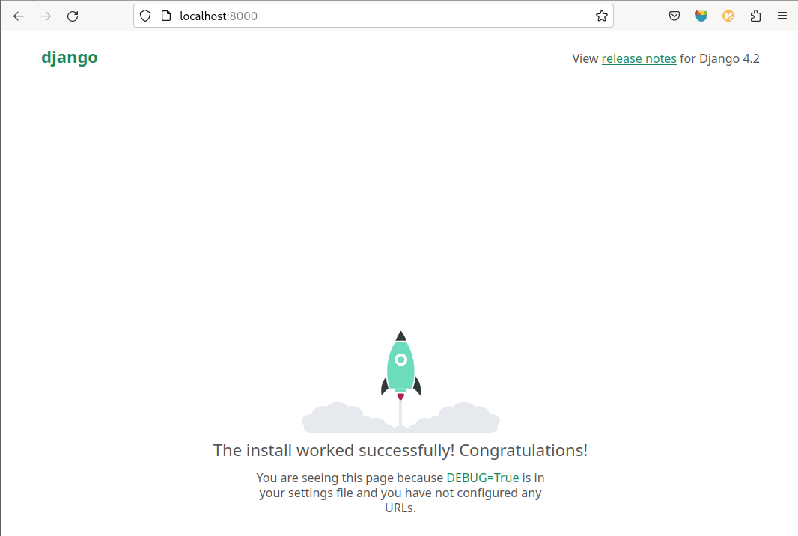
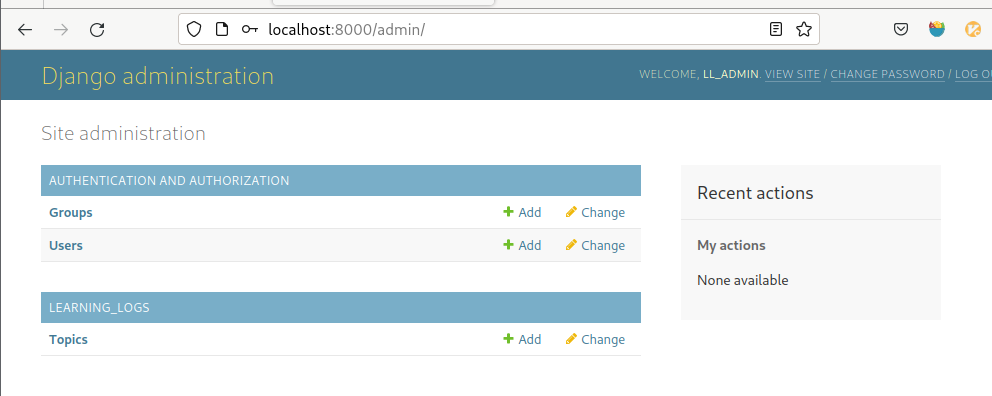

# Django 入门

Django 是一个 Web 框架，一套用于帮助开发交互式网站的工具。Django 能相应网页请求，还能轻松读写数据库、管理用户等

## 建立项目

我们要编写一个名为 《学习笔记》的 Web 应用程序，让用户能记录感兴趣的主题，并在学习每个主题的过程中添加日志条目。”学习笔记“ 的主页对这个网站进行描述，并邀请用户注册或登陆。用户登陆后，就可创建新主题、添加条目以及阅读既有条目

### 建立虚拟环境

使用 Django 前，先建立一个虚拟工作环境。虚拟环境是系统的一个位置，可以在其中安装包，并将其与其他 Python 包隔离。

将项目的库与其他项目分离是有益的，且为了后续将”学习笔记“部署到服务器，这也是必须的

为项目新建一个目录，将其命令为 `learning_log`，再在中断中进入这个目录，并创建一个虚拟环境， python3 可用下行命令创建虚拟环境

```py
> python -m venv ll_env
```

这里运行了模块 venv，并用它来创建爱你一个名为 ll_env 的虚拟环境

#### 激活虚拟环境

建立虚拟环境后，需要使用下面的命令激活它

```py
learning_log$ source ll_env/bin/activate
(ll_env)learning_log$
```

> 这个命令运行 ll_env/bin/activate 脚本，环境处于活动状态时，环境名将包含在括号内。这种情况下，可以在环境中安装包，并使用已安装的包。在 ll_env 中安装的包仅在该环境处于活动状态时才可用

要轻质使用虚拟环境，可执行命令

```py
(ll_env)learning_log$ deactiviate
learning_log$
```

#### 安装 Django

激活虚拟环境后，可通过 pip 安装 Django

```py
(ll_env)learning_log$ pip install Django
```

由于我们是在虚拟环境中工作，因此在所有的系统中，安装 Django 的命令都相同：不需要指定标志 --user,也无需使用 `python -m pip install package_name` 这种较长的命令

> Django 目前仅在虚拟环境处于活动状态时才可用

#### 在 Django 中创建项目

在依然处于活动的虚拟环境的情况下，执行下面的命令来新建一个项目

```sh
> django-admin startproject learning_log .
> l
total 12K
drwxr-xr-x 2 qinghuo qinghuo 4.0K May 22 16:57 learning_log
drwxr-xr-x 5 qinghuo qinghuo 4.0K May 22 16:42 ll_env
-rwxr-xr-x 1 qinghuo qinghuo  668 May 22 16:57 manage.py
> ls learning_log
asgi.py  __init__.py  settings.py  urls.py  wsgi.py

~/Desktop/py/zeroToOne/project/learning_log                py ll_env
```

`manage.py` 文件是一个简单的程序，它接受命令并将其交给 Django 的相关部分去运行。我们将使用这些命令来管理诸如使用数据库和运行服务器等任务

`settings.py` 指定 Django 如何与我们的系统交互以及如何管理项目

`urls.py` 告诉 Django 应创建哪些网页来相应浏览器请求

`wsgi.py` 文件帮助 Django 提供它创建的文件，这个文件名是 *Web Server Gateway Interface* (Web服务器网关接口)的首字母缩写

#### 创建数据库

Django 将大部分与项目相关的信息都存储在数据库中，因此我们需要创建一个供 Django 使用的数据库。

为给项目 “学习笔记” 创建数据库，需要在虚拟环境中执行下行命令

```sh
> python manage.py migrate
Operations to perform:
  Apply all migrations: admin, auth, contenttypes, sessions
Running migrations:
  Applying contenttypes.0001_initial... OK
  Applying auth.0001_initial... OK
  Applying admin.0001_initial... OK
--snip--

> ls
learning_log  ll_env  db.sqlite3  manage.py
```

我们将修改数据库称为`迁移数据库`。首次执行命令 `migrate` 时，将让 Django 确保数据库与项目的当前状态匹配。在使用 `SQLite` 的新项目中首次执行这个命令时，Django 将新建一个数据库。

> 通过 ls 命令，其输出表明 Django 又创建了一个文件 `db.sqlite3`。`SQLite` 是一种使用单个文件的数据库，是编写简单App 的理想选择，因为它让你不太关注数据库管理的问题

#### 查看项目

下面来合适 Django 是否正确地创建了项目。可执行命令 `runserver`

```sh
> python manage.py runserver
Watching for file changes with StatReloader
Performing system checks...

System check identified no issues (0 silenced).
May 22, 2023 - 09:09:41
Django version 4.2.1, using settings 'learning_log.settings'
Starting development server at http://127.0.0.1:8000/
Quit the server with CONTROL-C.
```

Django 启动一个服务器，让我们能看到系统中的项目，了解它们的工作情况。当我们在浏览器中输入 URL 以请求网页时，该 Django 服务器将进行相应

生成合适的网页，并将其发送给浏览器。

 

### 创建应用程序

Django 项目由一些列应用程序组成，它们协同工作，让项目成为一个整体。

我们暂时只创建一个应用程序，它将完成项目的大部分工作。

当前，在前面打开的中断窗口中应该还运行着 runserver 。再打开一个中断，并切换到 `manage.py` 所在的目录。激活该虚拟环境，再执行命令 `startapp`

```sh
> python manage.py startapp learning_logs
> ls
learning_log  learning_logs  ll_env  db.sqlite3  manage.py
> ls learning_logs
migrations  admin.py  apps.py  __init__.py  models.py  tests.py  views.py
```

命令 `startapp Appname` 让 Django 建立创建应用程序所需的基础设施。

现在查看项目目录，会发现新增了一个文件夹 `learning_logs`。打开该文件夹，看看 Django 创建了什么

其中最重要的文件是 `models.py, admin.py 和 views.py`。我们将使用 `models.py` 来定义我们要在应用程序中管理的数据

#### 定义模型

我们想一下要涉及的数据。美味用户都需要在学习笔记中创建很多主题。用户输入的每个条目斗鱼特定主题相关联，这些条目将以文本的方式显示。

我们还需要存储每个条目的时间戳，以便能够告诉用户各个条目都是什么时候创建的

models.py 的默认内容如下

```py
> cat learning_logs/models.py
from django.db import models
# Create your models here.
```

这里导入了模块 `models`，还让我们创建自己的模型。

> 模型告诉 Django 如何处理应用程序中存储的数据。在代码层面，模型就是一个类，包含属性和方法。

下面是表示用户将要存储的主题的模型

```py
> cat learning_logs/models.py
from django.db import models
# Create your models here.
class Topic(models.Model):
    """用户学习的主题"""
    text = models.CharField(max_length=200)
    date_added = models.DateTimeField(auto_now_add=True)

    def __str__(self):
        """返回模型的字符串表示"""
        return self.text
```

创建一个名为 `Topic` 的类，它继承了 `Model`————Django 中一个定义了模型基本功能的类。Topic 类只有两个属性，text 和 date_added

属性`text`是一个`CharField`————由字符或文本组成的数据。需要存储少量的文本，如名称、标题或城市时，可使用`CharField`。定义`CharField`属性时，必须告诉 Django 在数据库中预留多少空间。在这里，我们将`max_length`设置为200(即200个字符)，这对存储大多主题名来说足够了

属性`date_added`是一个`DateTimeField`————记录日期和时间的数据。我们传递了实参`auto_now_add=True`，每当用户创建新主题时，这都让 Django 将这个属性自动设置成当前日期和时间

> 要获悉可在模型中使用的各种字段，需参阅 Django Model Field Reference (Django 模型字段参考)

我们需要告诉 Django,默认应使用哪个属性来显示有关主题的信息。Django 调用方法 __str__()来显示模型的简单表示

#### 激活模型

要使用模型，必须让 Django 将应用程序包含到项目中。为此，打开 `settings.py`

```py
> cat learning_log/settings
# Application definition
INSTALLED_APPS = [
    'django.contrib.admin',
    'django.contrib.auth',
    'django.contrib.contenttypes',
    'django.contrib.sessions',
    'django.contrib.messages',
    'django.contrib.staticfiles',
    # 我的应用程序
    'learning_logs',
]
```

`INSTALLED_APPS`是一个列表，它告诉 Django 项目是由哪些 app 组成的。在这里将应用程序编组，在项目不断增大，包含更多的应用程序时，有助于对应用程序进行跟踪。

下面需要让 Django 修改数据库，使其能够存储与模型 Topic 相关的信息。需在终端执行下行命令

```sh
> python manage.py makemigrations learning_logs
Migrations for 'learning_logs':
  learning_logs/migrations/0001_initial.py
    - Create model Topic
```

命令`makemigrations`让 Django 确定该如何修改数据库，使其能存储与我们定义的新模型相关联的数据。输出表明 Django 创建了一个名为 `0001_initial.py` 的迁移文件，这个文件将在数据库中为模型 Topic 创建一个表

下面应用这种迁移，让 Django 替我们修改数据库

```sh
> python manage.py migrate
Operations to perform:
  Apply all migrations: admin, auth, contenttypes, learning_logs, sessions
Running migrations:
  Applying learning_logs.0001_initial... OK
```

这个命令的大部分输出与我们首次执行 `migrate` 的输出相同。在这里，Django 确认为 `learning_logs` 应用迁移时一切正常

- 每次需要修改 “学习笔记“ 管理的数据时，都采取如下三个步骤：
    1. 修改 models.py
    2. 对 learning_logs 调用 makemigrations
    3. 让 Django 迁移项目

#### Django 管理网站

为应用程序定义模型时，Django 提供的管理网站(admin site) 让我们轻松地处理模型。

##### 定义超级用户

Django 允许我们创建超级用户。权限决定了用户可执行的操作

为 Django 中创建超级用户，需执行下行命令

```sh
> python manage.py createsuperuser
Username (leave blank to use 'qinghuo'): ll_admin
Email address: #电子邮件可为空
Password:
Password (again):
This password is too common.
Bypass password validation and create user anyway? [y/N]: y
Superuser created successfully.
```

##### 像管理网站注册模型

Django 自动在管理网站中添加了一些模型，如 User 和 Group，但对于我们创建的模型，必须手动注册

我们创建 app `learning_logs` 时，Django 在 `models.py` 所在的目录中创建了一个名为 `admin.py` 的文件

```sh
> cat learning_logs/admin.py
from django.contrib import admin
# Register your models here.
```

为向管理网站注册 Topic，需写入代码如下

```py
> cat learning_logs/admin.py
from django.contrib import admin
from learning_logs.models import Topic #-------新增
# Register your models here.
admin.site.register(Topic) #-------新增
```

这些代码导入我们要注册的模型 Topic，再使用 `admin.site.register()` 让Django通过管理网站管理我们的模型

现在，使用超级用户访问管理网站 [admin](localhost:8000/admin/)，并输入刚才创建的账密 

 

##### 添加主题

向管理网站注册 Topic 后，我们来添加第一个主题。

为此，单击 Topic 进入主题网页，他几乎是空的，这是因为我们还没添加任何主题

