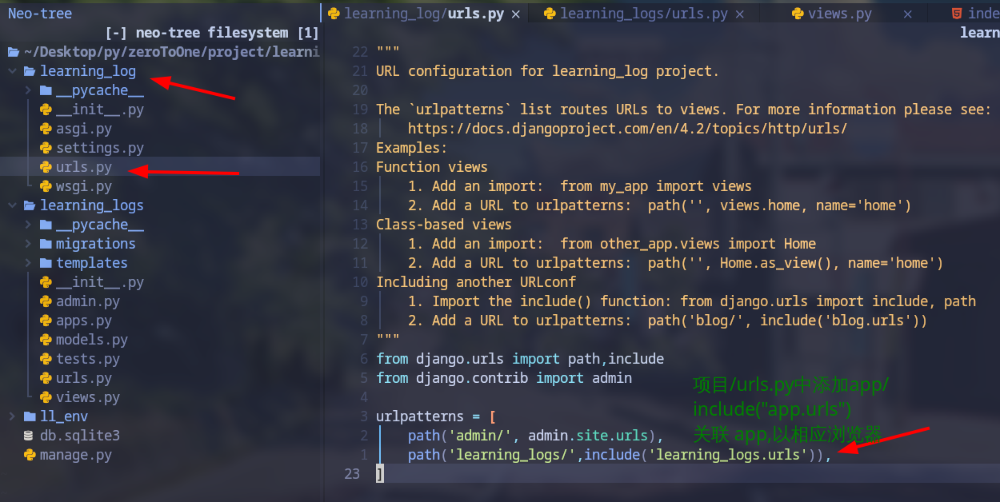

# Django 基础

检测是否安装成功

```py
> python
Python 3.11.3 (main, Apr  5 2023, 15:52:25) [GCC 12.2.1 20230201] on linux
Type "help", "copyright", "credits" or "license" for more information.
>>> import django
>>> django.get_version()
'4.2.1'
>>> exit()
```

## 文件结构

```py
#创建项目
> django-admin startproject mysite
```

django-admin 创建的默认文件结构如下：

```py
mysite/
    manage.py
    mysite/
        __init__.py
        settings.py
        urls.py
        asgi.py
        wsgi.py
```

- manage.py： 可以`用各种方式管理 Django 项目的命令行工具`
- 内层的 mysite/ 目录`包含自身的项目，它是一个纯 Python 包`。它的名字就是当你引用它内部任何东西时需要用到的 Python 包名(eg: mysite.urls)
- mysite/__init__.py：`一个空文件`，告诉 Python 这个目录应该被认为是一个 Python 包
- mysite/settings.py： `Django 项目的配置文件`
- mysite/urls.py： Django 项目的 URL 生命，就像网站的 *目录* 
- mysite/asgi.py： 作为你的项目的运行在 ASGI 兼容的 Web 服务器上的入口
- mysite/wsgi.py： 作为你的项目的运行在 WSGI 兼容的 Web 服务器上的入口

## 启动项目

```sh
python manage.py runserver
#默认监听 localhost:8000
```

## views && urls


在 app/ 的 views.py 中定义视图

在 project/urls.py 中关联 app/ 下的 urls.py

以下截图解释

 

 

 

 

 

### 修改项目目录下的路由关联

 

 

- 去掉路由 index 的方法

 

 
