## IO基础

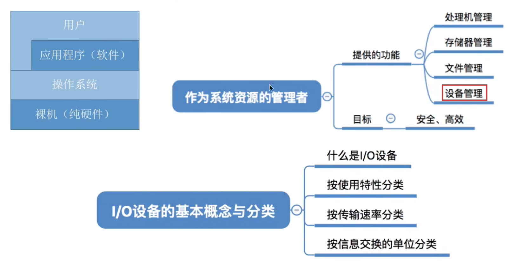

- 什么是IO？

*I/O*就是*输入/输出*(Input/Output)

IO设备就是可以将数据输入到计算机，或可以接受计算机输出的外部设备，属于计算机中的硬件部件

UNIX系统将外部设备抽象为一种特殊文件，用户可以使用与文件操作相同的方式对外部设备进行操作

***

- IO设备的分类--按使用特性


- 人际交互类外设
    * 鼠标、键盘、打印机等--用于人机交互
- 存储设备
    * 移动硬盘、光盘等--用于数据存储
- 网络通信设备
    * 调制解调器（猫）--用于网络通信

***

- IO设备的分类--按信息交换的单位分类


- 块设备
    * 如磁盘，数据传输的基本单位是*块*
- 字符设备
    * 鼠标、键盘等--数据传输的基本单位是字符

## IO控制器


- IO设备的```机械部件```主要用来执行具体的IO操作
    * 如鼠标/键盘的按钮、显示器的LED屏、移动硬盘的磁臂、磁盘盘面
- IO设备的```电子部件```通常是一块插入主办扩充槽的印刷电路板

***

- IO设备的电子部件(IO控制器)

CPU无法直接控制IO设备的机械部件，因此IO设备还要有一个电子部件作为CPU和IO设备机械部件之间的*中介*，用于实现CPU对设备的控制

这个电子部件就是```IO控制器```，又称```设备控制器```。CPU可控制IO控制器，又由IO控制器来控制设备的机械部件


IO控制器的功能
```
接受和识别CPU发出的命令
    如CPU发来的read/write命令，IO控制器中会有相应的 控制寄存器 来存放命令和参数
向CPU报告设备的状态
    IO控制器中会有相应的 状态寄存器，用于记录IO设备的当前状态。如：1表示空闲，0表示忙碌
数据交换
    IO控制器中会设置相应的 数据寄存器。输出时，数据寄存器用于暂存CPU发来的数据
    之后再由控制器传送设备。输入时，数据寄存器用于暂存设备发来的数据，之后由
    CPU从数据寄存器中取走数据
地址识别
    类似于内存中的地址，为了区分设备控制器中的各个寄存器，也需要给各个寄存器
    设置一个特定的地址。IO控制器通过CPU提供的地址来判断CPU要读写的是哪个寄存器
```

***

- IO控制器的组成

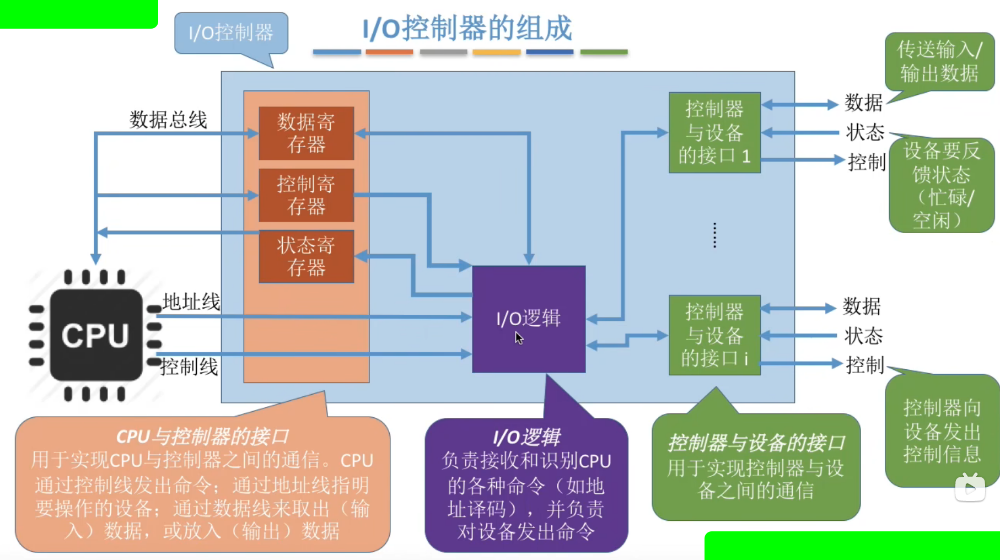

NOTE: 一个IO控制器可能会对应多个设备

数据寄存器、控制寄存器、状态寄存器可能有多个(如：每个控制/状态寄存器对应一个具体的设备)，且这些寄存器都要有相应的地址，才能方便CPU操作。有的计算机会让这些寄存器占用内存地址的一部分，称为```内存映像I/O```。另一些计算机则采用IO专用地址，即```寄存器独立编址```

***

- 内存映像IO vs 寄存器独立编址


## IO控制方式

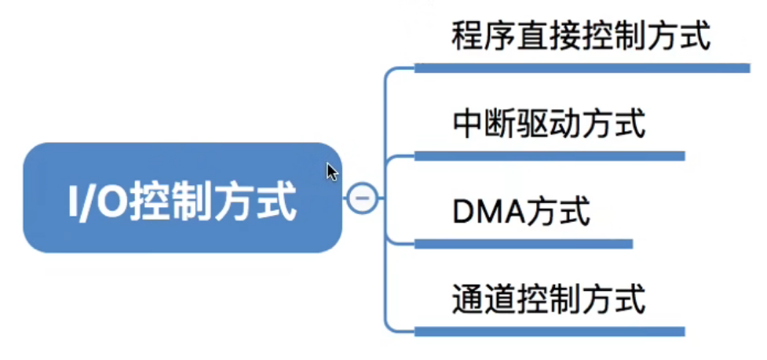

- 需要注意的问题：
    * 完成一次读/写操作的流程
    * CPU干预的频率
    * 数据传送的单位
    * 数据的流向
    * 主要缺点和主要优点

***
 
- 程序直接控制方式

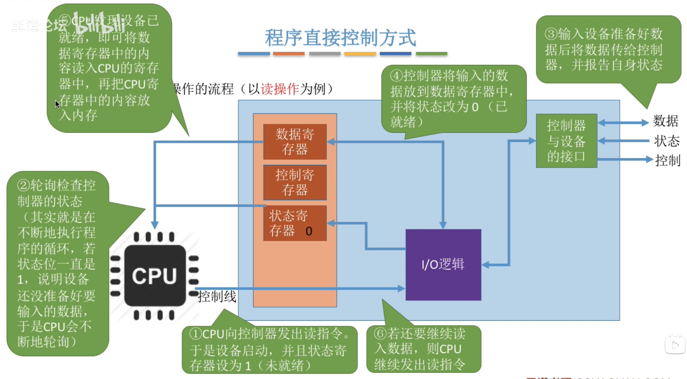

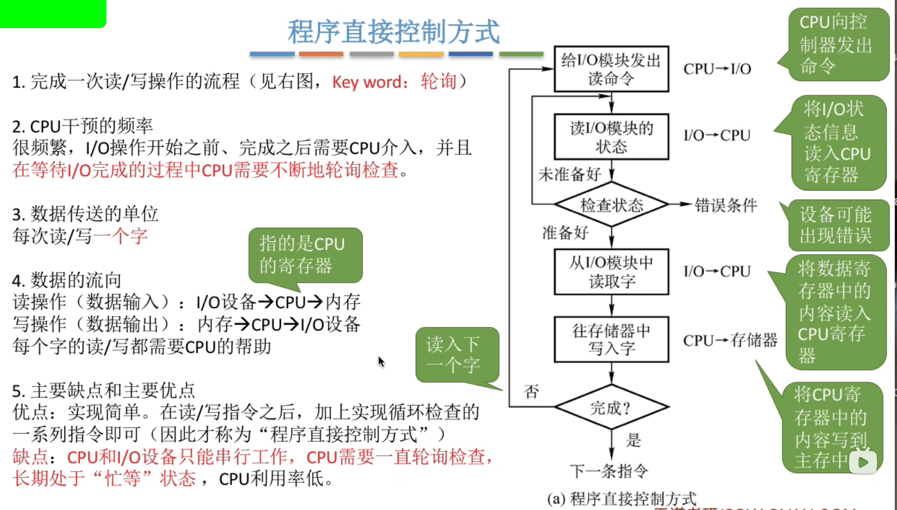

***
- 中断驱动方式

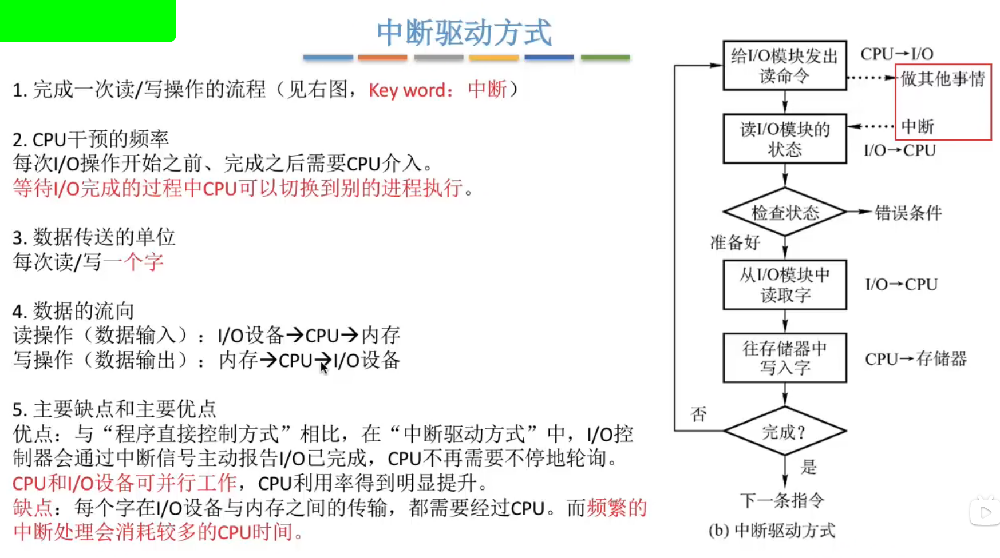

***

- DMA方式

与*中断驱动方式*相比，DMA(Direct Memory Access,直接存取器存取。主要用于块设备的IO控制)有以下几个改进

```数据的传送单位是“块”```。不再是一个字、一个字的传送

数据的流向是从设备直接放入内存，或者从内存直接到设备。不再需要CPU作为*快递小哥*

仅在传送一个或多个数据块的开始和结束时，才需要CPU干预


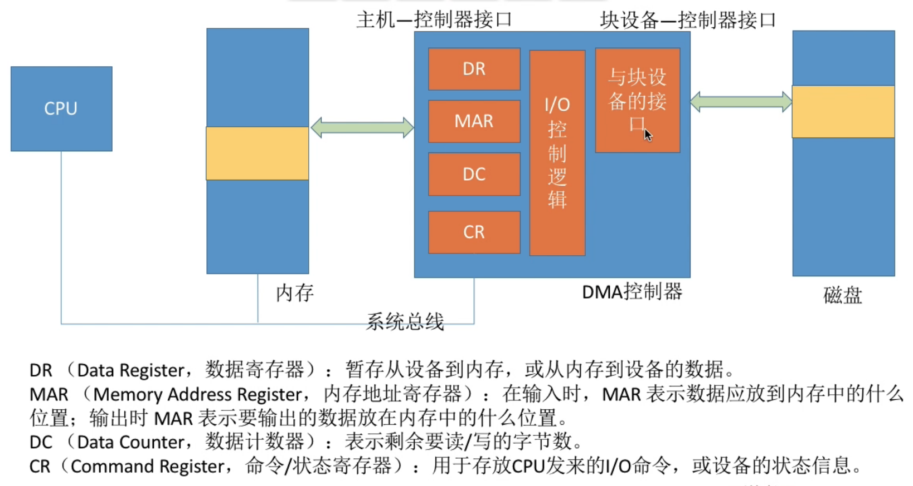
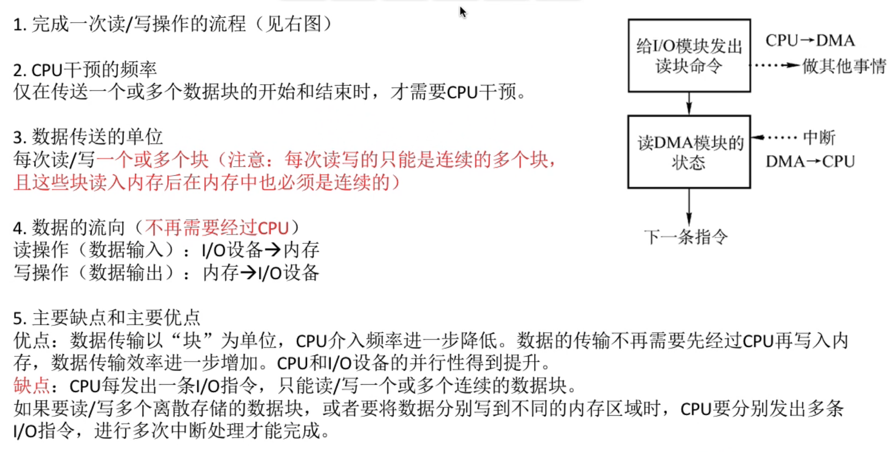

***

- 通道控制方式

通道：一种```硬件```，可以理解为*弱鸡版的CPU*。通道可以识别并执行一些列```通道指令```

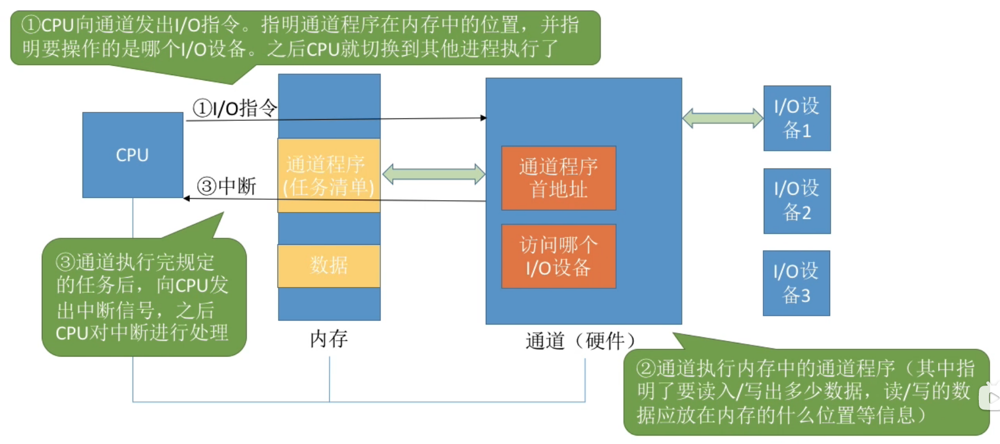
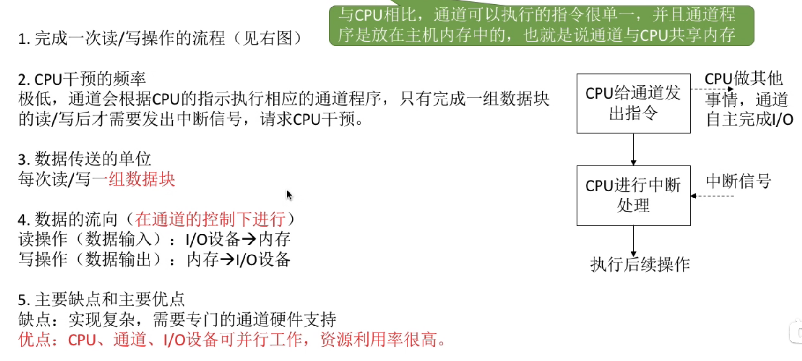


## IO软件层次


- 用户层软件


***

- 设备独立性软件

```设备独立性软件```又称```设备无关性软件```。与设备的硬件特性无关的功能几乎都在这一层实现

主要功能如下

```
向上层提供统一的调用接口(如read/write系统调用)
设备的保护
    原理类似与文件保护。设备被看作一种特殊文件，不同用户对各个文件的访问权限
    不同，同理，对设备的访问权限也不同
差错处理
    设备独立性软件需要对一些设备的差错进行处理
设备的分配与回收
数据缓冲区管理
    可以通过缓冲技术屏蔽设备之间数据交换单位大小和传输速度的差异
建立逻辑设备名到物理设备名的映射关系
    根据设备类型选择调用相应的驱动程序
    用户或用户曾软件发出I/O操作相关系统调用的系统调用时，需要指明此次要操作
    的IO设备的逻辑设备名(eg：去打印店打印时，需要选择打印机1/打印机2/打印机3
    其实这些都是 逻辑设备名)
```

```逻辑设备独立性软件```需要通过```逻辑设备表(LUT,Logical Unit Table)```来确定逻辑设备对应的```物理设备```，并找到该设备对应的```设备驱动程序```

OS可以采用两种方式管理```逻辑设备表(LUT)```

1. ```整个系统只设置一张LUT```，这就意味着所有用户不能使用相同的逻辑设备名，因此这种方式只适用于单用户操作系统
2. ```为每个用户设置一张LUT```，各个用户使用的逻辑设备名可以重复，适用于多用户操作系统。系统会在用户登录时为其建立一个用户管理进程，而LUT就存放在用户管理进程的PCB中

***

- 设备驱动程序

为什么不同的设备需要不同的设备驱动程序？

不同设备的内部硬件特性也不同，这些特性只有厂家才知道，因此厂家须痛殴共与设备相对应的驱动程序，CPU执行驱动程序的指令序列，来完成设置设备寄存器，检查设备状态等工作

设备驱动程序主要负责对硬件设备的具体控制，将上一层发出的一系列命令(如read/write)转化成功特定设备*能听懂*一系列操作。包括设置设备寄存器、检查设备状态等

note：驱动程序一般以一个独立进程的方式存在

***

- 中断处理程序

当IO任务完成时，IO控制器会发送一个```中断信号```，系统会```根据中断信号类型```找到相应的```中断处理程序```并执行。中断处理程序的处理流程如下

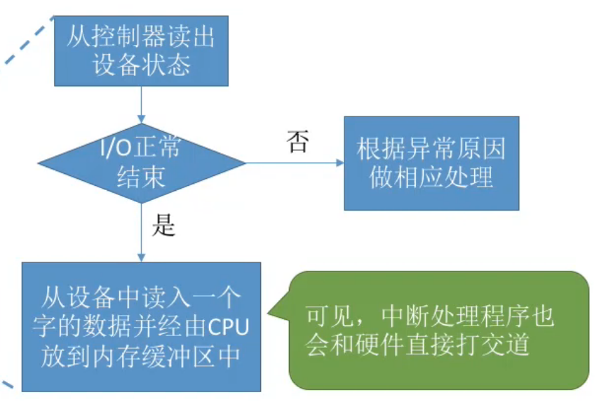

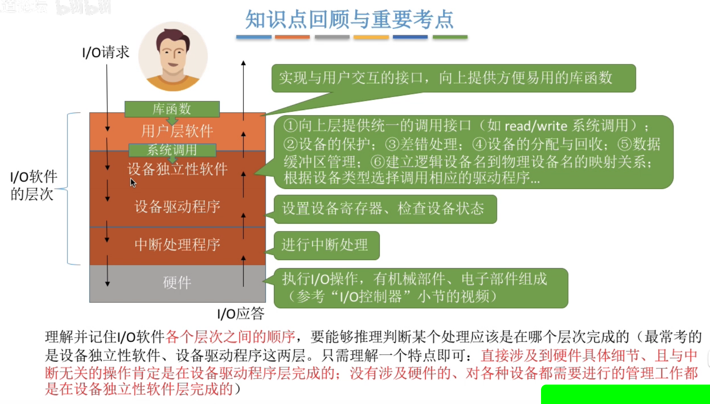

## IO核心子系统

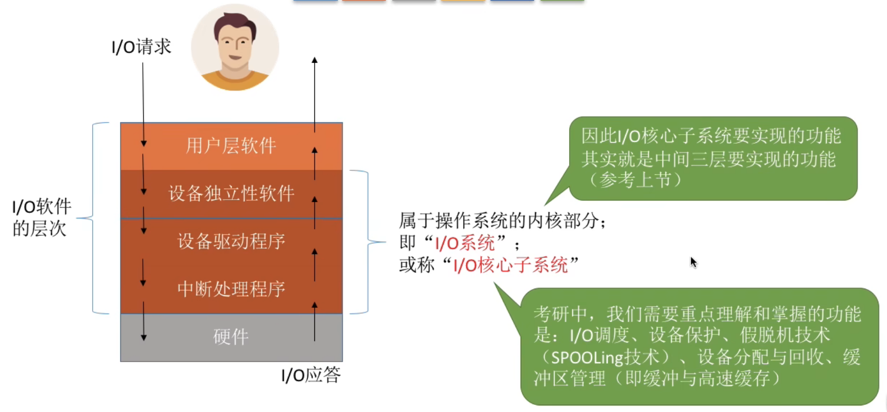

这些功能要在哪个层次实现？

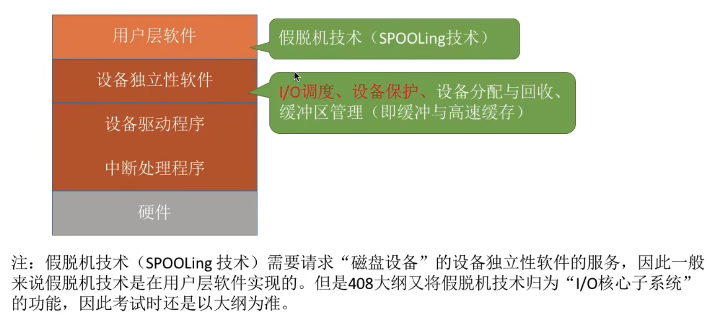

***

- IO调度

```IO调度：用某种算法确定一个好的顺序来处理各个IO请求```

如：磁盘调度(先来先服务算法、最短寻道优先宪法、SCAN算法、C-SCAN算法、LOOK算法、C-LOOK算法)。当多个磁盘IO请求到来时，用某种调度算法确定满足IO请求的顺序

同理，打印机等设备也可以用先来先服务算法、优先级算法、短作业优先等算法来确定IO调度顺序

***

- 设备保护

OS系统需要实现```文件保护功能```，不同的用户对各个文件有不同的访问权限(eg:只读、读和写等)

在UNIX系统中，```设备被看作是一种特殊的文件```，每个设备也会有对应的FCB.当用户请求访问某个设备时，系统根据FCB中记录的信息来判断该用户是否有相应的访问权限，以此实现*设备保护*的功能(参考文件保护的内容)

## 假脱机技术

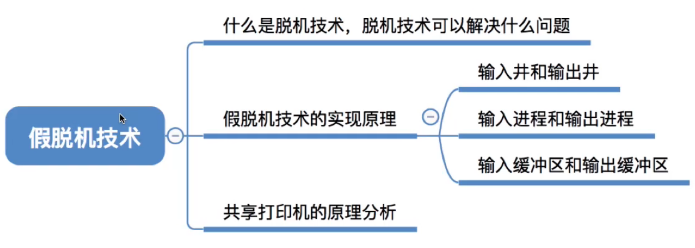

- 脱机技术

批处理阶段引入了```脱机技术/输出技术```(用磁带完成)

```脱机```：指脱离主机的控制进行的输入/输出操作

引入脱机技术后，环节了CPU与慢速IO设备的速度矛盾。另一方面，即使CPU在忙碌，也可以提前将数据输入到磁带。即使慢速的输出设备正在忙碌，也可以提前将数据输出到磁带

***

- 假脱机技术--输入井和输出井

```假脱机技术```又称```SPOOLing技术```，是用软件的方式模拟脱机技术。SPOOLing系统的组成如下


输入进程模拟脱机输入时的外围控制机，输出进程模拟脱机输出时的外围控制机

note：输入/输出缓冲区是在内存中的缓冲区

在输入进程的控制下，”输入缓冲区*用于暂时从输入设备输入的数据，之后再转存到输入井中

在输出进程的控制下，“输出缓冲区”用于暂存从输出井送来的数据，之后再传送到输出设备上

***

- 共享打印机原理分析

独占式设备--```只允许各个进程串行使用的设备```。一段时间内只能满足一个进程的请求

共享设备--```允许多个进程“同时”使用的设备```(宏观上同时使用，微观上可能是交替使用)。可以同时满足多个进程的使用请求

打印机是种*独占式设备*，但是可以用SPOOLing技术改造成*共享设备*

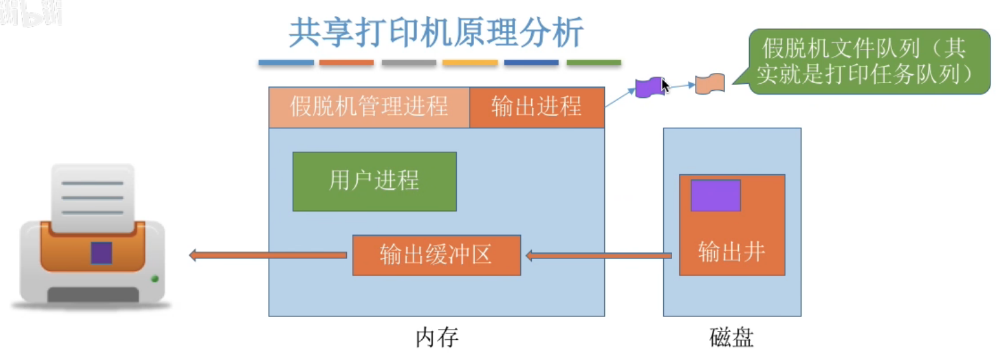

当多个用户进程提出输出打印的请求时，系统会答应他们的请求，但并不是真正把打印机分配给他们，而是由加脱机管理进程为每个进程做两件事

1. 在此安排你输出井中为进程申请一个空闲缓冲区(也就是说，这个缓冲区在磁盘上)，并将打印的数据送入其中
2. 为用户进程申请一张空白的打印请求表，并将用户的打印请求填入表中(其实就是用来说明用户的打印数据存放位置等信息的)，再将该表挂到假脱机文件队列上

当打印机空闲时，输出进程会从文件队列的队头取出一张打印请求表，并根据表汇总的要求将要打印的数据从输出井传送到输出缓冲区，再输出到打印机进行打印。用这种方式可依次处理完全部的打印任务

虽然系统中只有一台打印机，但每个进程提出打印请求时，系统都会为在输出井中为其分配一个存储区(相当于分配了一个逻辑设备)，使每个用户进程都觉得自己在独占一台打印机，从而实现对打印机的共享

SPOOLing技术可以把一台物理设备```虚拟```成逻辑上的多台设备，```可将独占式设备改造成共享设备```


