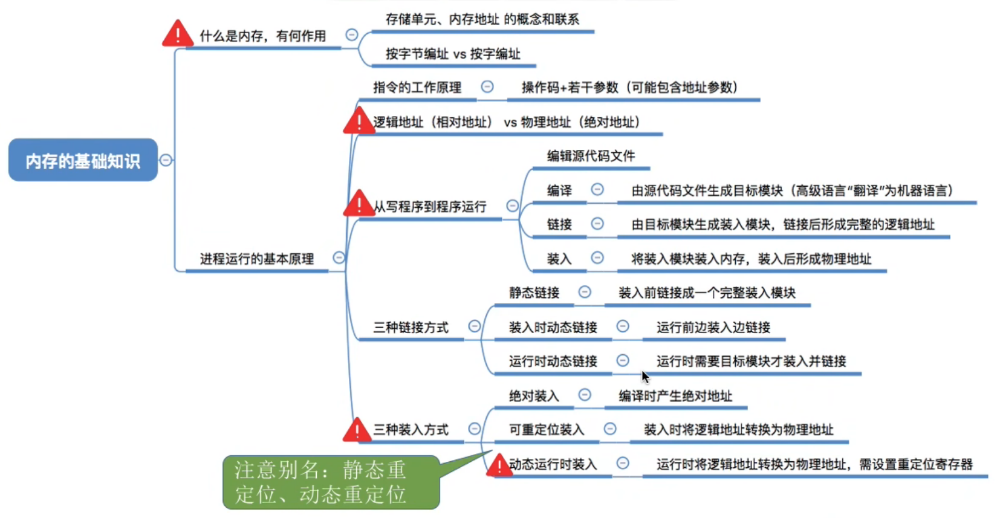
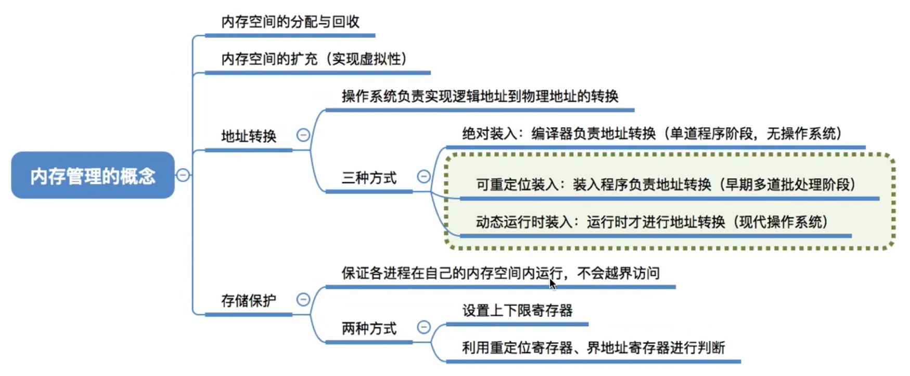
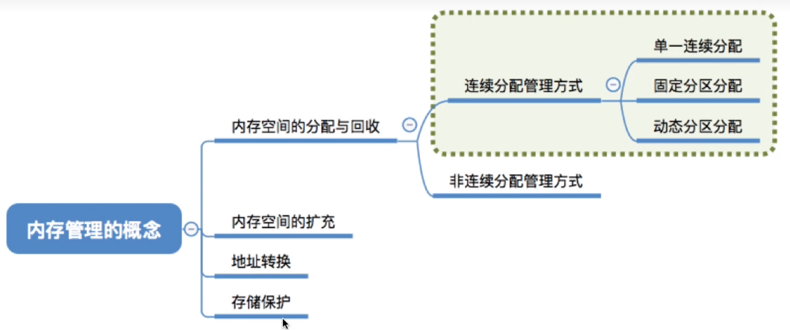
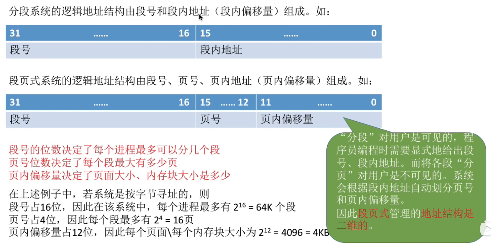

## 内存

程序执行前```需要先放到内存中才能被CPU处理```


```相对地址```又称```逻辑地址```，```绝对地址```又称```物理地址```

***

装入的三种方式(用3种不同方式完成```逻辑地址到物理地址的转换```)
1. 绝对装入
2. 静态重定位
3. 动态重定位

绝对装入：在编译时，如果知道程序将放在内存中的哪个位置，编译程序将产生绝对地址的目标代码。装入程序按照装入模块中的地址，将程序和数据装入内存

程序中使用的绝对地址，可在编译或会汇编时给出，也可由程序员直接赋予。通常都是编译或汇编时再转换为绝对地址

绝对装入```只适用于单道程序环境```

***

静态重定位

```静态重定位```：又称```可重定位装入```。编译、链接后的装入模块的地址都是从0开始的，指令中使用的地址、数据存放的地址都是相对于起始地址而言的逻辑地址。可根据内存的当前情况，将装入模块装入到内存的适当位置。装入时对地址进行*重定位*，将逻辑地址变换为物理地址(地址变换实在装入时一次完成的)


***

动态重定位

```动态重定位```：又称```动态运行时装入```。编译、链接后的装入模块的地址都是从0开始的。装入程序把装入模块装入内存后，并不会立即把逻辑地址转换为物理地址，而是```把地址转换推迟到程序真正要执行时才进行```。因此装入内存后所有的地址依然是逻辑地址。这种方式需要一个```重定位寄存器```的支持


***

进程运行的基本原理


编译：由编译程序将用户源代码编译成若干个目标模块(编译就是把高级语言```翻译为机器语言```)

链接：由链接程序将编译后形成的一组目标模块，以及所需库函数链接在一起，形成一个完整的装入模块

装入(装载):由装入程序将装入模块装入内存运行

***

链接的三种方式

1. 静态链接：在程序运行之前，先将各目标模块及他们所需的库函数链接成一个完整的可执行文件(装入模块)，之后不再拆开
2. 装入时动态链接：将各目标模块装入内存时，边装入边链接的链接方式
3. 运行时动态链接：在程序执行中需要该目标模块时，才对它进行链接。其优点是便于修改和更新，便于实现对目标模块的共享



## 内存管理

操作系统作为系统资源的管理者，当然也需要对内存进行管理，要管理什么？

- 操作系统要怎么记录哪些内存区域已经被分配出去了，哪些又还空闲？
- 很多位置都可以放，应该放在哪里？
- 当进程运行结束后，如何将进程占用的内存空间回收？

1. 操作系统负责```内存空间的分配与回收```
2. 操作系统需要提供某种技术从逻辑上```对内存空间进行扩充```
3. 操作系统需要提供```地址转换功能```，负责程序的逻辑地址与物理地址的转换
4. 操作系统需要提供```内存保护```功能。保证各进程在各自存储空间内运行，互不干扰

#### 内存保护

假设此刻内存中有2各进程，进程1的落地址空间为0～179,实际物理地址空间为100～279

内存保护可采取两种方法：

1. 在CPU中```设置一对上、下限寄存器```，存放进程的上、下限地址。进程的指令要访问某个地址时，CPU检查是否越界

2. 采用```重定位寄存器```(又称基址寄存器)和```界地址寄存器```(又称限长寄存器)进行越界检查。重定位寄存器中存放的是进程的```起始物理地址```。界地址寄存器中存放的是进程的```最大逻辑地址```



#### 覆盖与交换

覆盖技术

早期的计算机内存很小，比如IBM推出的第一台PC机最大只支持1MB大小的内存。因此经常出现内存不够的情况

后来人们引入了```覆盖技术```，用来```解决程序大小超过物理内存总和的问题```

覆盖技术的思想：将```程序分为多个段```(多个模块)。常用的段常驻内存，不常用的段在需要时调入内存

内存中分为```一个固定区```和```若干个覆盖区```。需要常驻内存的段放在```固定区```,```调入后就不再调出```(除非运行结束)。不常用的段放在```覆盖区```，```需要用到时调入内存，用不到时调出内存```

***

交换技术

交换(对换)技术的设计思想：内存空间紧张时，系统将内存中某些进程暂时```换出```外存，把外存中某些已具备与西宁条件的进程```换入```内存(进程在内存与磁盘间动态调度)

```中级调度(内存调度)```，就是要决定将哪个处于挂起状态的进程重新调入内存

暂时换出外存等待的进程状态为```挂起状态(挂起态，suspend)```。挂起态又可以进一步细分为```就绪挂起、阻塞挂起```两种状态（进程七状态模型）

- 应该在外存的什么位置保存被换出的进程？

具有对换功能的OS中，通常把外存分为```文件区```和```对换区```两部分。

```文件区```主要用于存放文件，```主要追求存储空间的利用率```，因此对文件区空间的管理```采用离散分配方式```。

```对换区```空间只占外存的小部分，```被换出的进程数据就存放在对换区```。由于对换的速度直接影响到系统的整体速度，因此对换区空间的管理```主要追求换入换出速度```，因此通常对换区```采用连续分配方式```。总之，```对换区的IO速度比文件区的更快```

- 什么时候应该交换？

交换通常在许多进程运行且内存吃紧时进行，而系统负荷降低就暂停。

例如：在发现许多进程运行时经常发生缺页，说明内存紧张，此时可以换出一些进程，如果缺页率明显下降，就可以暂停换出

- 应该换出哪些进程？

可以优先换出阻塞进程，可换出优先级低的进程，为了放置优先级低的进程在被调入内存后很快又被换出，有的系统还会考虑进程在内存的驻留时间

```NOTE：PCB会常驻内存```，不会被换出外存


#### 连续分配管理



```连续分配```：指为用户进程分配的必须是一个```连续的内存空间```

***

单一连续分配

在单一连续分配方式中，内存被分为```系统区```和```用户区```。系统取通常位于内存的低地址部分，用于存放OS相关数据，用户区用于存放用户进程相关数据

内存中```只能有一道用户程序```,用户程序独占整个用户区空间。

优点：实现简单，```无外部碎片```。可以采用覆盖技术扩充内存，不一定需要采取内存保护

缺点：只能用于但用户、单任务的OS中，有```内部碎片```，存储器利用率极低

***

固定分区分配

20世纪60年代出现了支持多道程序的系统，为了能在内存中装入多道程序，且这些程序之间又不会相互干扰，于是将整个```用户空间```划分为```若干个固定大小的分区```，在```每个分区中只装入一道作业```，这样就形成了最早的、最简单的一种可运行躲到程序的内存管理方式

- 固定分区分配
    * 分区大小相等
    * 分区大小不等

分区大小相等：缺乏灵活性，但是很```适合用于用一台计算机控制多个相同对象的场合```

分区大小不等：增加了灵活性，可以满足不同大小的进程需求。根据常在系统中运行的作业大小情况 进行划分

OS需要建立一个数据结构--```分区说明表```，来实现各个分区的分配与回收。每个表项对应一个分区，通常按分区大小排列。每个表项包括对应分区的```大小、起始地址、状态(是否已分配```)

当某用户程序要装入内存时，由OS内核程序根据用户程序大小检索该表，从中找到一个能满足大小的、未分配的分区，将之分配给该程序，然后修改状态为*已分配*

优点：实现简单，无外部碎片

缺点：当用户程序太大时，可能所有的分区都不能满足需求，此时不得不采用覆盖技术来解决，但这又会降低性能。```会产生内部碎片```，内存利用率低

***

动态分区分配

```动态分区分配```又称为```可变分区分配```。这种分配方式```不会预先划分内存分区```，而是在进程装入内存时，```根据进程的大小动态地建立分区```，并使分区的大小正好适合进程的需要。因此系统分区的大小和数目是可变的

动态分区分配```没有内部碎片```，但是有```外部碎片```

```内部碎片```：分配给某进程的内存区域中，如果有些部分没有用哈桑

```外部碎片```：指内存中的某些空闲分区由于太小而难以利用

如果内存中空闲空间的总和本来可以满足某进程的要求，但由于进程需要的是一整块连续的内存空间，因此这些*碎片*不能满足进程的需求

可以通过```紧凑(拼凑，Compaction)技术来解决外部碎片

- 系统要使用什么样的数据结构记录村内的使用情况？


- 当很多个空闲分区都能满足需求时，应该选择哪个分区进行分配？

把一个新作业装入内存时，需按照一定的```动态分区分配算法```，从空闲分区表(或空闲分区链)中选出一个分区分配给该作业。后面有4中分配方式


- 如何进行分区的分配与回收操作？

略


#### 动态分区分配

```动态分区分配算法```：在动态分区分配方式中，当很多个空闲分区都能满足需求时，应该选择哪个分区进行分配？


首次适应算法

算法思想：每次都从低地址开始查找，找到第一个能满足大小的空闲分区。

如何实现：```空闲分区以地址递增的次序排列```。每次分配内存时顺序查找```空闲分区链```(或空闲分区表)，找到大小能满足要求的第一个空闲分区

***

最佳适应算法

算法思想：由于动态分区分配是一种连续分配方式，为各进程分配的空间必须是连续的一整区域。因此为了保证当*大进程*到来时能有连续的大片空间，可以尽可能多地留下大片的空闲区，即，有限使用更小的空闲区。

如何实现：空闲分区```按容量底层次序链接```。每次分配内存时顺序查找```空闲分区链```(或空闲分区表)，找到大小能满足要求的第一个空闲分区

缺点：每次都选最小的分区进行分配，会留下越来越多的，很小的，难以利用的内存块。因此这种这种方法会产生很多的外部碎片

***

最坏适应算法又称```最大适应算法```(Largest Fit)

算法思想：为了解决最佳适应算法的问题--即留下太多难以利用的小碎片，可以在每次分配时优先使用最大的连续空闲区，这样分配后剩余的空闲区就不会太小，更方便使用。

如何实现：空闲分区```按容量递减次序链接```。每次分配内存时顺序查找```空闲分区链```(或空闲分区表)，找到大小能满足要求的第一个空闲分区

缺点：每次都选最大的分区进行分配，虽然可以让分配后留下的空闲区更大，更可用，但这种方法会导致较大的连续空闲区被迅速用完。如果之后有*大进程*到达，就没有内存分区可用了

***

邻近适应算法

算法思想：首次适应算法每次都从链头开始查找。这可能会导致低地址部分出现很多小的空闲分区，而每次分配查找时，都要经过这些分区，因此也增加了查找的开销。如果每次都从赏赐查找结束的位置开始检索，就能解决上述问题

如何实现：空闲分区以地址递增的顺序排列(可排成一个循环链表)。每次分配内存时```从上次查找结束的位置开始```查找```空闲分区链```(或空闲分区表)，找到大小能满足要求的第一个空闲分区

首次适应算法每次都要从头查找，每次都需要检索低地址的小分区。但是这种规则也决定了当低地址部分有更小的分区可以满足需求时，会更有可能用到低地址部分的小分区，也会更有可能把高地址部分的大分区保留下来(最佳适应算法的优点)

邻近适应算法的规则可能会导致无论低地址、高地址部分的空闲分区都有相同的概率被使用，也就导致了高地址部分的大分区更可能被使用，划分为小分区，最后导致无大分区可用(最大适应算法的缺点)

综合来看，```四种算法中，首次适应算法的效果反而更好```


## 分页存储

基本概念：

连续分配方式的缺点：

1. 固定分区分配：缺乏灵活性，会产生大量的内部碎片，内存的利用率很低
2. 动态分区分配：会产生很多外部碎片，虽然可以用*紧凑*技术来处理，但是*紧凑*的时间代价很高

如果允许将一个进程分散地装入到许多不喜爱你桂林的分区中，便可充分地利用内存，而无需再进行*紧凑*

基于这一思想，产生了*非连续分配方式*，或称为*离散分配方式*


```连续分配```：为用户进程分配的必须是一个```连续的内存空间```
```非连续分配```：为用户进程分配的可以是一些```分散的内存空间```

***

把*固定分区分配*改造为*非连续分配版本*


将内存空间分为一个个```大小相等的分区```(比如：每个分区4KB)，每个分区就是一个```页框```，或称```页帧```、```内存块```、```物理块```。每个页框有一个编号，即```页框号```(或内称内存块号、页帧号、物理块号)，页框号```从0开始```

将用户进程的地址空间也分为```与页框大小相等```的一个个区域，称为```页```或```页面```。每个页面也有一个编号，即```页号```，页号也是```从0开始```。(note：进程的最后一个页面可能没有一个页框那么大。因此，```页框不能太大，否则可能产生过大的内存碎片```)

OS```以页框为单位为各个进程分配```内存空间。进程的每个页面分别放入一个页框中。也就是说，进程的```页面```与内存的```页框```有```一一对应```的关系

各个页面必须连续存放，也不惜按先后顺序来，可以放到不相邻的各个页框中

***

如何实现地址的转换？

进程在内存中```连续存放时```，OS是通过重定位寄存器(存放装入模块存放的*起始位置*)来实现逻辑地址到物理地址的转换的

思想：模块在内存中的```起始地址``` + 目标内存单元相对于起始位置的```偏移量```


```
页号 = 逻辑地址 / 页面长度(取出发的 整数 部分)
页号 = 80 / 50 = 1

页内偏移量 = 逻辑地址 % 页面长度 (取除法的 余数 部分)
页内偏移量 = 80 % 50 = 30
页面 在内存中的起始位置：
    OS需要用某种数据结构记录进程各个页面的起始位置
1号页在内存中存放的 起始位置 450

为了方便计算页号、页内偏移量，页面大小一般设置为 2的整数幂
```


***

上面图片可以算出逻辑地址对应的页号，逻辑地址在页面内的偏移量，但还无法知道该页号对应```页面在内存中的起始地址```

为了能知道进程的每个页面在内存中存放的位置，OS要```为每个进程建立一张页表```


为什么每个页表项的长度是相同的，页号是*隐含*的？


#### 基本地址变换机构

基本地址变换机构可以借助进程的页表将逻辑地址转换为物理地址

通常会在系统中设置一个```页表寄存器```(PTR),存放```页表在内存中的起始地址F```和```页表长度M```。进程未执行时，页表的始址 和 页表长度 ```放在进程控制块PCB```中，当进程被调度时，OS内科会把他们放到页表寄存器中

NOTE：```页面大小是2的整数幂```

设页面大小为L,逻辑地址A到物理地址E的变换过程如下


```
1.计算页号P和页内偏移量W(如果用十进制，则P=A/L,W=A%L;但是在计算机运行时，逻辑
    地址结构是固定不便的，因此计算机硬件可以更快得到二进制表示的页号，页内偏移量)

2.比较页号P和页表长度M,若P>=M,则产生越界中断，否则继续执行。(note：页号是从0开始的，
    而页表长度至少是1,因此 P =   时也会越界)

3. 页表中页号P对应的 页表项地址 = 页表起始地址F + 页号P * 页表项长度，取出该页表项
    内容b,即为内存块号。(注意区分 页表项长度、页表长度、页面大小的区别。)
    (页表长度指 这个页表中共有几个页表项，即总共有几个页; 
    页表项长度指每个页表项占多大的存储空间
    页面大小指一个页面占多大的存储空间)

4.计算E = B * L + W,用得到的物理地址E去访存。
    (如果内存块号、页内偏移量使用二进制表示的，那么将二者拼接起来就是最终的物理地址)
```


***


#### 具有快表的地址变换机构


局部性原理：

```时间局部性```：如果执行了程序中的某条指令，那么不久后这条指令很可能再次执行，如果某个数据被访问过，不久之后该数据很可能再次被访问(大量循环的情况下)

```空间局部性```：一旦程序访问了某个存储单元，在不久之后，其附近的存储单元也很有可能被访问(因为很多数据在内存中都是连续存放的)

前面的```基本地址变换机构```中，每次访问一个逻辑地址，都需要```查询内存中的页表```。由于局部性原理，```可能连续很多次查到的都是同一个页表项```。既然如此，能否利用这个特性减少访问页表的次数呢？

***

```快表```，又称```联想寄存器```(TLB),是一种```访问速度比内存快很多```的高速缓冲存储器，用来存放当前访问的若干页表项，以加速地址变换的过程。与此对应，内存中的页表常称为```慢表```


引入快表后，地址的变换过程

1. CPU给出逻辑地址，由某个硬件算出页号、页内偏移量，将页号与快表中的所有页号进行比较
2. 如果找到匹配的页号，说明要访问的页表项在快表中有副本，则直接从中去除该页对应的内存块号，再将内存块号与页内偏移量拼接形成物理地址，最后```访问```该物理地址对应的```内存单元```。因此，若```快表命中```，则访问某个逻辑地址仅需```一次访存```即可
3. 若没有匹配的页号，则需要```访问内存中的页表(慢表)```，找到对应页表项，得到页面存放的内存块号，再将内存块号与页内偏移量拼接形成物理地址，最后，```访问```该物理地址对应的```内存单元```。因此，若```快表未命中```,则访问某个逻辑地址需要```两次访问```(note：在找到页表项后，应同时将其存入快表，以便后面可能的再次访问。若快表已满，则必须按照一定的算法对旧的页表项进行替换)

由于查询快表的速度比查询页表的速度快很多，因此只要快表命中，就可以节省很多时间。因为局部性原理，一般来说快表的命中率可以达到90%以上


#### 两级页表

 

单级页表存在的问题

 

1. 页表必须连续存放，因此当页表很大时，需要占用很多个连续的页框
2. 根据局部性原理克制，很多时候，```进程在一段时间内只需要访问某几个页面就可以正常运行```。因此```没有必要让整个页表都常驻内存```

***

解决单级页表的第一个问题--页表要连续存放

可将常常的页表进行分组，使每个内存块刚好放入一个分组(比如上个例子中，页面大小4KB,每个页表项4B,每个页面可存放1K个页表项，因此每1K个连续的页表项为彝族，每组刚好站一个内存块，再将各组离散的放到各个内存块中)

另外，要为离散分配的页表再建立一张页表，成为```页目录表```，或```外城页表```，```顶层页表```

 
 

***

解决单级页表的第二个问题--无需让整个页表常驻内存
 

***

两级页表注意事项：

若采用多极页表机制，则```各级页表的大小不能超过一个页面```
 

- 两级页表的```访存次数```分析(假设没有快表机构)
    * 第一次访存：访问内存中的页目录表
    * 第二次访存：访问内存中的二级页表
    * 第三次访存：访问目标内存单元

 

#### 基本分段存储管理

 

分段

进程的地址空间：按照程序```自身的逻辑```关系```划分为若干个段```,每个段都有一个段名(在低级语言中，程序员使用段名来编程)，```每段都从0开始编址```

内存分配规则：以段为单位进行分配，```每个段在内存中占据连续空间```，但```各段之间可以不相邻```

 
 

***

程序分为多个段，各段离散地装入内存，为了保证程序能正常运行，就必须能从物理内存中找到各个逻辑段的存放位置。为此，需要为每个进程建立一张段映射表，简称```段表```

 

每个段对应一个段表项，其中记录了该段在内存中的```起始位置```(又称*基址*)和段的长度

```各个段表项的长度是相同的```。例如：某系统按字节殉职，采用分段存储管理，逻辑地址结构为(段号16,段内地址16位)，因此用16位即可表示最大段长。物理内存大小为4GB(可用32位表示整个物理内存地址空间)。因此，可以让每个段表项站 16 + 32 = 48位，即6B.由于段表项长度相同，因此```段号是可以隐含的，不占存储空间```。若段表存放的起始地址为M,则K号段对应的段表项存放的地址为M + K * 6

***

分段、分页管理的对比

```页```是```信息的物理单位```。分页的主要目的是为了实现离散分配，提高内存利用率。分页仅仅是系统管理上的需要，完全是系统行为，```对用户是不可见的```

```段```是```信息的逻辑单位```。分段的主要目的是更好的满足用户需求。一个段通常包含着一组属于一个逻辑模块的信息。```分段对用户是可见的```，用户编程时需要显式地给出段名

页的大小固定且由系统决定。段的长度缺不固定，决定于用户编写的程序

```分页```的用户进程```地址空间是一维的```，程序员只需给出一个记忆符即可表示一个地址

```分段```的用户进程```地址空间是二维的```，程序员在标识一个地址时，既要给出段名，也要给出段内地址

```分段```比*分页*```更容易实现信息的共享和保护```

不能被修改的代码称为```纯代码```或```可重入代码```(不属于临界资源)，这样的代码是可以共享的。可修改的代码是不能共享的(比如一个代码段中有很多变量，各进程并发地同时访问可能造成数据不一致)

访问一个逻辑地址需要几次访存？

```分页(单级页表)```：第一次访存--查内存中的页表，第二次访存--访问目标内存单元。总共```两次访问```

```分段```：第一次访存--查内存中的段表，第二次访存--访问目标内存单元。总共```两次访存```

与分页系统类似，分段系统也```可以引入快表机构```，将近期访问过的段表项放到快表中，这样```可以少一次访问```，加快地址变换速度

 

#### 段页式管理方式

 

分页、分段的优缺点分析

 

段页式管理 = 分段 + 分页

将进程按逻辑模块分段，再将各段分页(如每个页面4KB)，再将内存空间分为大小相同的内存块/页框/页帧/物理块。进程前将各页面分别装入各内存块中

 
 


