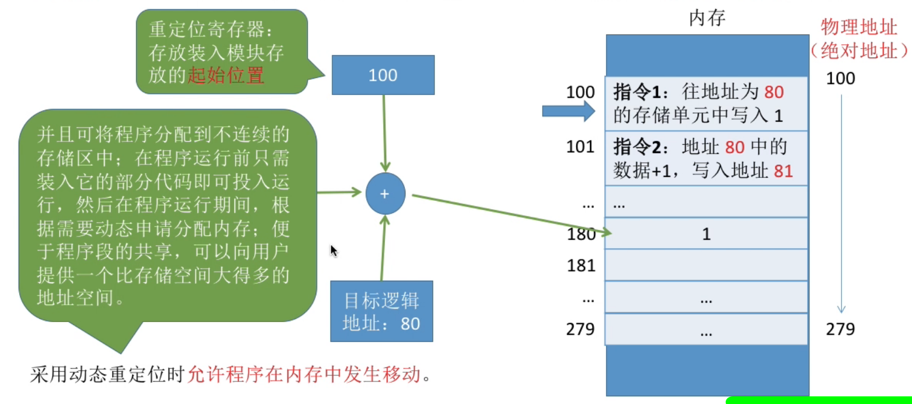

## 内存

程序执行前```需要先放到内存中才能被CPU处理```


```相对地址```又称```逻辑地址```，```绝对地址```又称```物理地址```

***

装入的三种方式(用3种不同方式完成```逻辑地址到物理地址的转换```)
1. 绝对装入
2. 静态重定位
3. 动态重定位

绝对装入：在编译时，如果知道程序将放在内存中的哪个位置，编译程序将产生绝对地址的目标代码。装入程序按照装入模块中的地址，将程序和数据装入内存

程序中使用的绝对地址，可在编译或会汇编时给出，也可由程序员直接赋予。通常都是编译或汇编时再转换为绝对地址

绝对装入```只适用于单道程序环境```

***

静态重定位

```静态重定位```：又称```可重定位装入```。编译、链接后的装入模块的地址都是从0开始的，指令中使用的地址、数据存放的地址都是相对于起始地址而言的逻辑地址。可根据内存的当前情况，将装入模块装入到内存的适当位置。装入时对地址进行*重定位*，将逻辑地址变换为物理地址(地址变换实在装入时一次完成的)


***

动态重定位

```动态重定位```：又称```动态运行时装入```。编译、链接后的装入模块的地址都是从0开始的。装入程序把装入模块装入内存后，并不会立即把逻辑地址转换为物理地址，而是```把地址转换推迟到程序真正要执行时才进行```。因此装入内存后所有的地址依然是逻辑地址。这种方式需要一个```重定位寄存器```的支持



***

进程运行的基本原理


编译：由编译程序将用户源代码编译成若干个目标模块(编译就是把高级语言```翻译为机器语言```)

链接：由链接程序将编译后形成的一组目标模块，以及所需库函数链接在一起，形成一个完整的装入模块

装入(装载):由装入程序将装入模块装入内存运行

***

链接的三种方式

1. 静态链接：在程序运行之前，先将各目标模块及他们所需的库函数链接成一个完整的可执行文件(装入模块)，之后不再拆开
2. 装入时动态链接：将各目标模块装入内存时，边装入边链接的链接方式
3. 运行时动态链接：在程序执行中需要该目标模块时，才对它进行链接。其优点是便于修改和更新，便于实现对目标模块的共享


## 内存管理

操作系统作为系统资源的管理者，当然也需要对内存进行管理，要管理什么？

- 操作系统要怎么记录哪些内存区域已经被分配出去了，哪些又还空闲？
- 很多位置都可以放，应该放在哪里？
- 当进程运行结束后，如何将进程占用的内存空间回收？

1. 操作系统负责```内存空间的分配与回收```
2. 操作系统需要提供某种技术从逻辑上```对内存空间进行扩充```
3. 操作系统需要提供```地址转换功能```，负责程序的逻辑地址与物理地址的转换
4. 操作系统需要提供```内存保护```功能。保证各进程在各自存储空间内运行，互不干扰

#### 内存保护

假设此刻内存中有2各进程，进程1的落地址空间为0～179,实际物理地址空间为100～279

内存保护可采取两种方法：

1. 在CPU中```设置一对上、下限寄存器```，存放进程的上、下限地址。进程的指令要访问某个地址时，CPU检查是否越界

2. 采用```重定位寄存器```(又称基址寄存器)和```界地址寄存器```(又称限长寄存器)进行越界检查。重定位寄存器中存放的是进程的```起始物理地址```。界地址寄存器中存放的是进程的```最大逻辑地址```


#### 覆盖与交换

覆盖技术

早期的计算机内存很小，比如IBM推出的第一台PC机最大只支持1MB大小的内存。因此经常出现内存不够的情况

后来人们引入了```覆盖技术```，用来```解决程序大小超过物理内存总和的问题```

覆盖技术的思想：将```程序分为多个段```(多个模块)。常用的段常驻内存，不常用的段在需要时调入内存

内存中分为```一个固定区```和```若干个覆盖区```。需要常驻内存的段放在```固定区```,```调入后就不再调出```(除非运行结束)。不常用的段放在```覆盖区```，```需要用到时调入内存，用不到时调出内存```

***

交换技术

交换(对换)技术的设计思想：内存空间紧张时，系统将内存中某些进程暂时```换出```外存，把外存中某些已具备与西宁条件的进程```换入```内存(进程在内存与磁盘间动态调度)

```中级调度(内存调度)```，就是要决定将哪个处于挂起状态的进程重新调入内存

暂时换出外存等待的进程状态为```挂起状态(挂起态，suspend)```。挂起态又可以进一步细分为```就绪挂起、阻塞挂起```两种状态（进程七状态模型）

- 应该在外存的什么位置保存被换出的进程？

具有对换功能的OS中，通常把外存分为```文件区```和```对换区```两部分。

```文件区```主要用于存放文件，```主要追求存储空间的利用率```，因此对文件区空间的管理```采用离散分配方式```。

```对换区```空间只占外存的小部分，```被换出的进程数据就存放在对换区```。由于对换的速度直接影响到系统的整体速度，因此对换区空间的管理```主要追求换入换出速度```，因此通常对换区```采用连续分配方式```。总之，```对换区的IO速度比文件区的更快```

- 什么时候应该交换？

交换通常在许多进程运行且内存吃紧时进行，而系统负荷降低就暂停。

例如：在发现许多进程运行时经常发生缺页，说明内存紧张，此时可以换出一些进程，如果缺页率明显下降，就可以暂停换出

- 应该换出哪些进程？

可以优先换出阻塞进程，可换出优先级低的进程，为了放置优先级低的进程在被调入内存后很快又被换出，有的系统还会考虑进程在内存的驻留时间

```NOTE：PCB会常驻内存```，不会被换出外存


