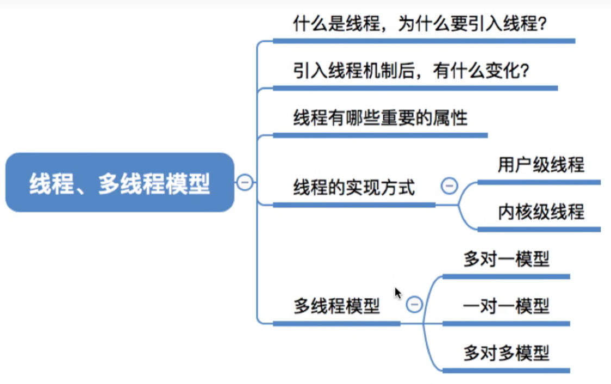
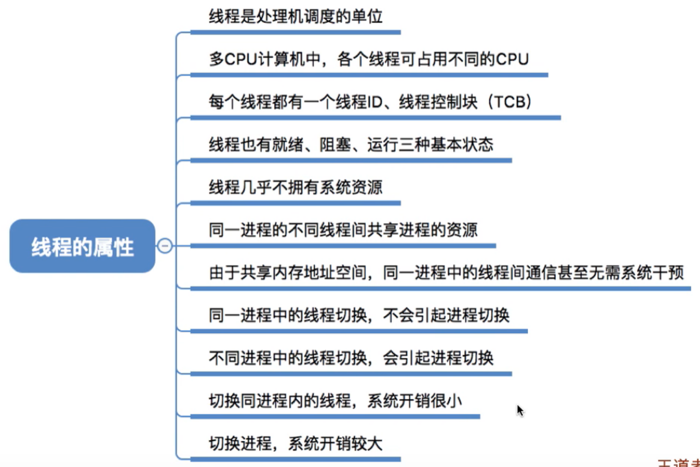
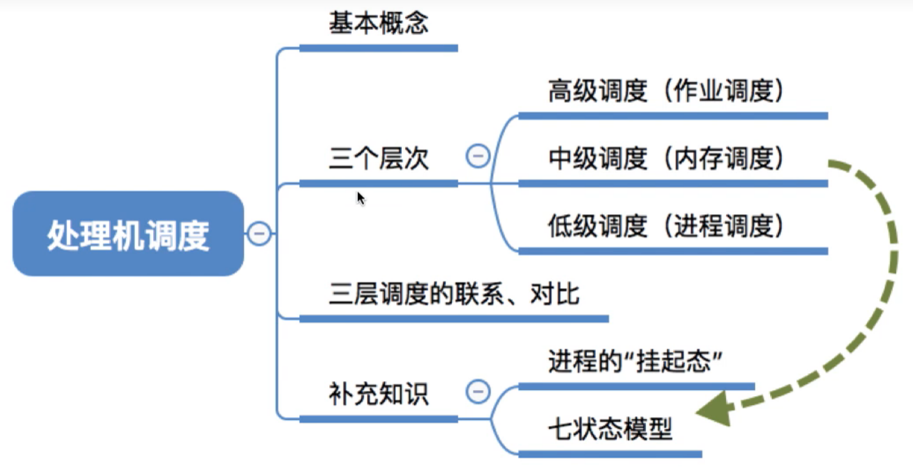

## 线程

为什么要有线程？

有的进程可能需要*同时*做很多事，而传统的进程只能串行地执行一系列程序。为此，引入了*线程*，来增加并发度，可以把线程理解为*轻量级线程*

```线程```是一个```基本的CPU执行单元```，也是```程序执行流的最小单位```。引入线程后，不仅是进程之间可以并发，进程内的```各线程之间```也可以```并发```，从而进一步```提升了系统的并发度```，使得一个进程内也可以并发处理各种任务(如QQ视频，文字聊天，传文件等)

引入线程后，```进程```只作为```出CPU之外的系统资源的分配单元```(如打印机、内存地址空间等都是分配给进程的)



#### 引入线程机制后，带来的变化


#### 线程的属性



#### 线程的实现方式

用户级线程(User Level Thread,ULT)

用户级线程由APP通过```线程库```实现。所有的```线程管理工作```都由APP负责(包括线程切换)

用户级线程中，```线程切换```可以在```用户态下即可完成```，无需OS干预。在用户看来，是有多个线程。但是在OS kernel看来，并意识不到线程的存在(用户极线程对用户不透明，对OS透明)

内核极线程(Kernel Level Thread, KLT)

内核级```线程的管理工作```由OS kernel完成。线程调度、切换等工作都由内核负责，因此```内核级线程的切换```必须在```核心态```下才能完成

在同时支持用户级线程和内核级线程的系统中，可采用二者组合的方式：将n个用户级线程映射到m个内核级线程上(n >= m)

OS只*看得见*内核级线程，因此只有```内核级线程才是处理机分配的单位```

#### 多线程

在同时支持用户级线程和内核极线程的系统中，由几个用户级线程映射到几个内核级线程的问题引出了*多线程模型*的问题

```多对一```模型：多个用户级线程映射到一个内核级线程。每个用户进程只对应一个内核极线程

*优点*：用户级线程的切换在用户空间即可完成，不需要切换到核心态，线程管理的系统开销小，效率高

*缺点*：当一个用户级线程被阻塞后，整个进程都会被阻塞，并发度不高。多个线程不可在多和处理机上并行运行

*** 

```一对一```模型：一个用户级线程映射到一个内核极线程。每个用户进程有与用户级线程同数量的内核极线程

*优点*：当一个线程被阻塞后，其他线程还可以继续执行，并发能力强。多线程可在多核处理机上并行执行

*缺点*：一个用户进程会占用多个内核极线程，线程切换由操作系统内核完成，需要切换到核心态，因此线程管理的成本高，开销大
***
```多对多```模型：n用户级线程映射到m个内核极线程(n >= m)。每个用户进程对应m个内核极线程

克服了多对一模型并发度不高的缺点，又克服了一对一模型中一个用户进程占用太多内核极线程，开销太大的缺点

## 处理机调度



当有一堆任务要处理，但由于资源有限，这些事情无法同时处理。这就需要确定```某种规则```来```决定```处理这些任务的```顺序```，这就是*调度*研究的问题

在多道程序系统中，进程的数量往往是多于处理机的个数的，这样不可能同时并行地处理各个进程。```处理机调度```，就是从就绪队列中```按照一定的算法选择一个进程```并```将处理机分配给他```运行，以实现进程的并发执行

#### 高级调度

由于内存空间有限，有时无法将用户提交的作业全部放入内存，因此就需要确定某种规则来决定将作业调入内存的顺序。

```高级调度(作业调度)```。按照一定的原则从外存上处于后备队列的作业中选择一个(或多个)作业，给他们分配内存等必要资源，并```建立相应的进程(建立PCB)```，以使它(们)```获得竞争处理机的权力```

高级调度是外存与内存之间的调度。每个作业只调入一次，调出一次。```作业调入时会建立相应的PCB,作业调出时才撤销PCB```。高级调度主要是指调入的问题，因为只有调入的时机需要OS来确定，但调出的时机必然是作业运行结束才调出

#### 中级调度

引入虚拟存储技术后，可将暂时不能运行的进程调至外存等待。等它重新具备了运行条件且内存有空闲爱你时，再重新调入内存。这么做的目的是为了```提高内存利用率```和```系统吞吐量```

暂时调到外存等待的进程状态为```挂起状态```。指的注意的是，PCB并不会一起调到外存，而是```会常驻内存```。PCB中记录进程数据在外存中的存放位置，进程状态等信息，OS通过内存中的PCB来保持对各个进程的监控、管理。被挂起的进程PCB会被放到```挂起队列```中

```中级调度(内存调度)```，就是要决定将哪个处于挂起状态的进程重新调入内存。一个进程可能会被多次调出、调入内存，因此```中级调度```发生的``频率```要高于```高级调度```

***

暂时调到外存等待的进程状态为```挂起状态(挂起态，suspend)```

挂起态又可以细分为```就绪挂起```，```阻塞挂起```两种状态


#### 低级调度

```低级调度(进程调度)```，其主要任务是按照某种方法和策略从就绪队列中取出一个进程，将处理机分配给它

进程调度是OS中```最基本的一种调度```，在一般的OS中都必须配置进程调度。进程调度的```频率很高```，一般几十毫秒一次

***


