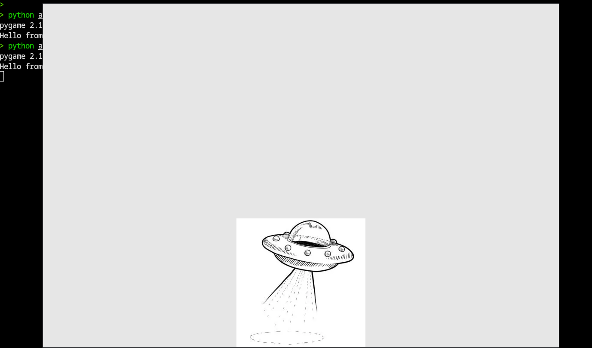
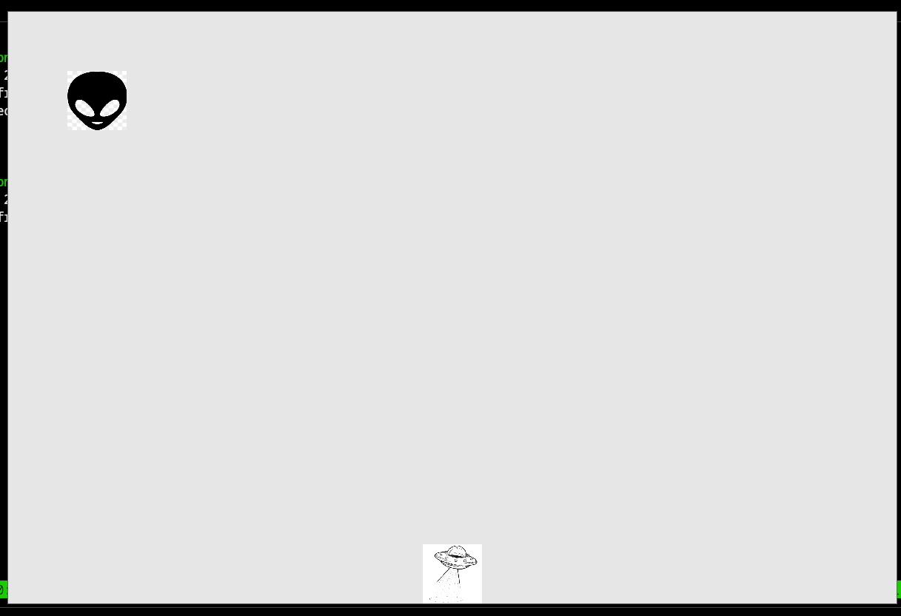
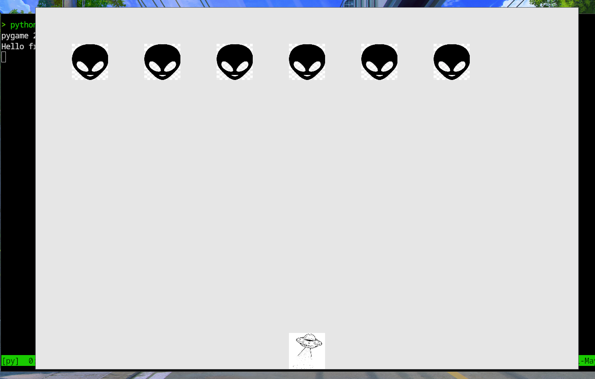
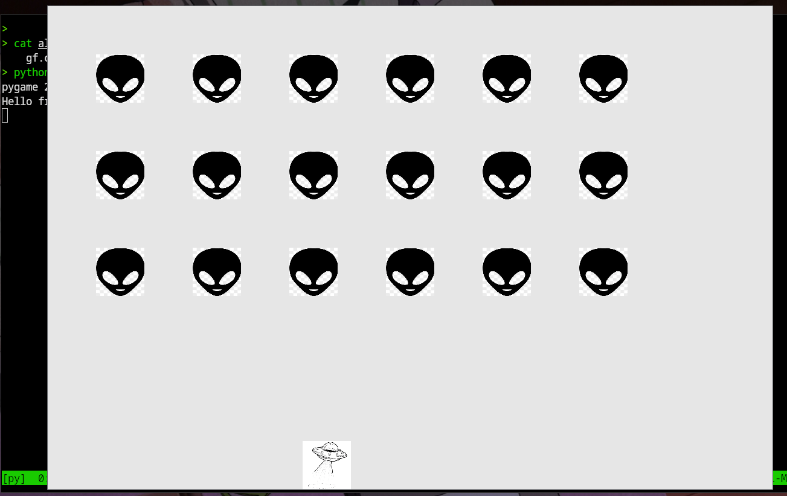
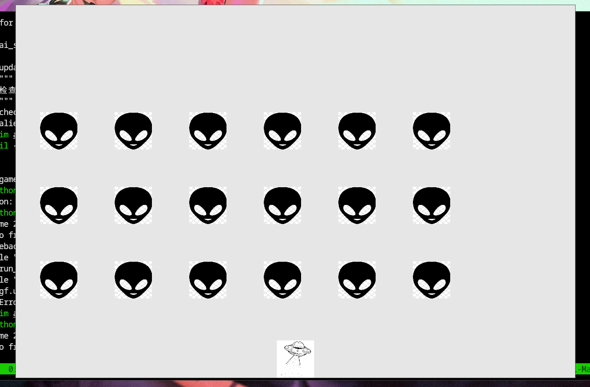
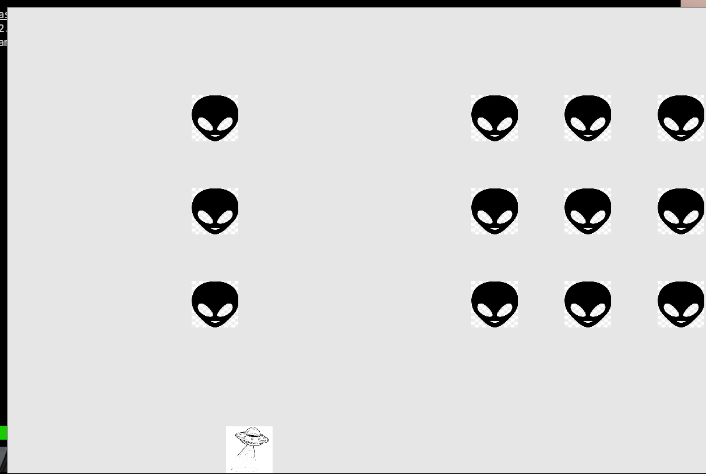
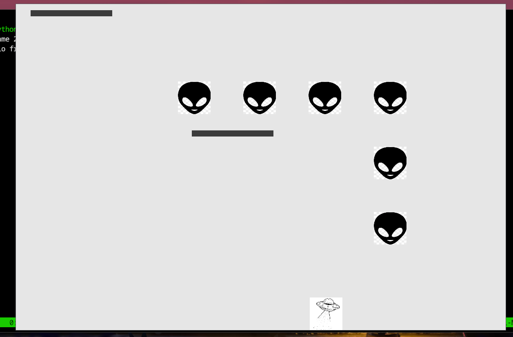
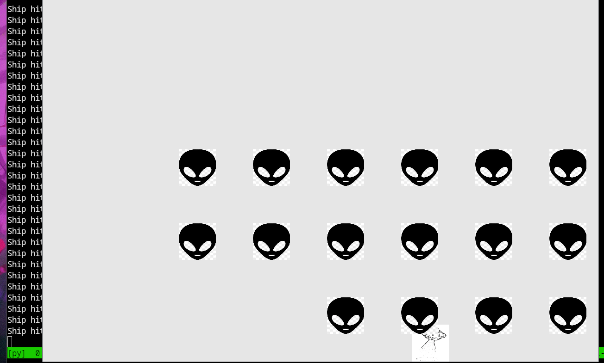

# 外星人入侵

使用`pygame`开发的一个 2d 游戏

`pygame`可用于管理图形、动画乃至声音，可让开发者轻松开发复杂的游戏。通过使用 pygame 来处理在屏幕上绘制图像等任务，不用考虑容多繁琐而艰难的编码工作，而是将重点放在程序的高级逻辑上

## 飞船篇

### 创建游戏窗口

首先创建一个空的 pygame 窗口，供后面用来绘制游戏元素

```py
> cat alien_invasion.py
import sys
import pygame

def run_game():
    """初始化游戏并创建一个屏幕对象"""
    pygame.init() # 初始化背景设置,让 pygame 能正确工作
    screen = pygame.display.set_mode((1200,800))
    pygame.display.set_caption("Alien Invasion")

    #开始游戏的主循环
    while True:
        #监听键盘和鼠标事件
        for event in pygame.event.get():
            if event.type == pygame.QUIT:
                sys.exit()

        #让最近绘制的屏幕可见
        pygame.display.flip()

run_game()
```

玩家退出时，使用模块 `sys` 来退出游戏。

对象 screen 是一个 `surface`。在 pygame 中，`surface` 是屏幕的一部分，用于显示游戏元素。在这个游戏游戏中，每个元素(eg：外星人或飞船) 都是一个 `surface`。`display.set_mode()`返回的 surface 表示整个游戏窗口。每次循环都会重绘这个 surface


while 循环内包含一个`事件循环以及管理屏幕更新的代码`。事件由用户触发(eg：案件或移动鼠标)。为了让程序响应时就爱你，我们编写一个事件循环，以监听事件，并根据发生的事件执行相应的任务

`pygame.event.get()`会监听键盘或鼠标的事件，事件会促使 for 循环执行。

`pygame.display.flip()` 命令 Pygame 让最近绘制的屏幕可见。在这里，它在每次执行 while 循环时都绘制一个空屏幕，并擦除旧屏幕，使得只有新屏幕可见。后续在移动游戏元素时，`pygame.display.flip() 将不断更新屏幕，以显示元素的新位置，并在原来的位置隐藏元素，从而营造平滑移动的效果`

#### 设置背景色

pygame 默认创建一个黑色屏幕，现在来设置背景色

```py
> cat alien_invasion.py
import sys
import pygame

def run_game():
    """初始化游戏并创建一个屏幕对象"""
    pygame.init()
    screen = pygame.display.set_mode((1200,800))
    pygame.display.set_caption("Alien Invasion")

    #设置背景色
    bg_color = (230,230,230) #---------新增

    #开始游戏的主循环
    while True:
        #监听键盘和鼠标事件
        for event in pygame.event.get():
            if event.type == pygame.QUIT:
                sys.exit()

        #每次循环时都重绘屏幕
        screen.fill(bg_color) #---------新增
        #让最近绘制的屏幕可见
        pygame.display.flip()

run_game()
```

在 pygame 中，颜色以 RGB 指定，取值为 0～255

通过调用 `screen.fill()`，用背景色填充屏幕，这个方法只接收一个实参：一种颜色

#### 创建设置类

每次给游戏添加新功能时，通常也将引入一些新设置。现在来编写一个名为 `settings` 的模块，其中包含一个名为 `Settings` 的类，用于将所有设置存储在一个地方。

```py
> cat settings.py
class Settings():
    """存储《外星人入侵》的所有设置的类"""
    def __init__(self):
        """初始化游戏的设置"""
        #屏幕设置
        self.screen_width = 1200
        self.screen_height = 800
        self.bg_color = (230,230,230)
```

为创建 `Settings` 实例并使用它来访问设置，将 `alien_invasion.py` 修改

```py
> cat alien_invasion.py
import sys
import pygame

from settings import Settings

def run_game():
    """初始化游戏并创建一个屏幕对象"""
    pygame.init()
    ai_settings = Settings() #------------新增
    screen = pygame.display.set_mode(
        (ai_settings.screen_width,ai_settings.screen_height)
    ) #------------新增
    pygame.display.set_caption("Alien Invasion")

    #开始游戏的主循环
    while True:
        #监听键盘和鼠标事件
        for event in pygame.event.get():
            if event.type == pygame.QUIT:
                sys.exit()

        #每次循环时都重绘屏幕
        screen.fill(ai_settings.bg_color)
        #让最近绘制的屏幕可见
        pygame.display.flip()

run_game()
```

### 添加飞船图像

为了在屏幕上绘制玩家的飞船，需要加载一副图像，再使用 pygame 的方法 `blit()` 绘制它

在游戏中几乎可以使用任何类型的图像文件，但使用`位图(.bmp)`文件最简单，因为 pygame 默认加载位图

我们将飞船的图片移动到 ./images 下，并重命名为 ship.bmp

#### 创建 Ship 类

选择飞船图像后，需要将其显示到屏幕上。我们创建一个名为 ship 的模块，其中包含 Ship 类，它负责管理飞船的大部分行为

```py
> cat ship.py
import pygame

class Ship():
    def __init__(self, screen):
        """初始化飞船并设置其初始位置"""
        self.screen = screen

        # 加载飞船图像并获取其外接矩形
        self.image = pygame.image.load("images/ship.bmp") #加载图像
        self.rect = self.image.get_rect()
        self.screen_rect = screen.get_rect()

        # 将每艘新飞船放在屏幕底部中央
        self.rect.centerx = self.screen_rect.centerx
        self.rect.bottom = self.screen_rect.bottom

    def blitme(self):
        """在指定位置绘制飞船"""
        self.screen.blit(self.image,self.rect)
```

`Ship 的方法 __init__` 接收的 screen 参数表示：要将飞船绘制到什么地方

`pygame.image.load()` 方法返回一个表示飞船的 `surface`，我们将这个 surface 存储到了 `self.image` 中

`get_rect()` 获取相应 surface 的属性 `rect`。pygame 效率之所以高，一个原因是它让你能处理矩形(rect 对象)一样处理游戏元素，即便他们的形状并非举行

处理 `rect` 对象时，可设置相应 rect 对象的属性 `center, centerx 和 centery`。要让游戏元素与屏幕边缘对齐，可使用属性 `top, bottom, left 和 right`。要调整游戏元素的水平或垂直距离，可使用属性 x 和 y。他们分别是`相应矩形左上角的 x 和 y 坐标`

目前我们将飞船放在了屏幕底部中央。而我们定义的方法`Ship.blitme()` 会根据 `self.rect` 指定的位置将图像绘制到屏幕上

#### 在屏幕上绘制飞船

现在更新 alien_invasion.py，使其创建一艘飞船并显示在屏幕上

```py
> cat alien_invasion.py
import sys
import pygame

from settings import Settings
from ship import Ship

def run_game():
    """初始化游戏并创建一个屏幕对象"""
    pygame.init()
    ai_settings = Settings()
    screen = pygame.display.set_mode(
        (ai_settings.screen_width,ai_settings.screen_height)
    )
    pygame.display.set_caption("Alien Invasion")

    #创建一艘飞船
    ship = Ship(screen) #-------------新增

    #开始游戏的主循环
    while True:
        #监听键盘和鼠标事件
        for event in pygame.event.get():
            if event.type == pygame.QUIT:
                sys.exit()

        #每次循环时都重绘屏幕
        screen.fill(ai_settings.bg_color)
        ship.blitme()   #-------------新增
        #让最近绘制的屏幕可见
        pygame.display.flip()

run_game()
```

现在运行 alien_invasion.py。可以看到飞船位于空游戏屏幕底部中央 

 

### 重构

重构旨在简化既有代码的结构，使其更容易扩展

现在让我们创建一个名为 game_functions 的新模块，它将存储大量让游戏 《外星人入侵》运行的函数。通过创建 game_functions，可避免 alien_invasion.py 文件太常

#### 函数 check_events()

首先把管理时间的代码移到一个名为 `check_events()` 的函数中，以简化 `run_game()`，并隔离事件管理循环。通过隔离事件循环，可将时间管理与游戏的其他方面(eg：更新屏幕) 分离。

将 `check_events()` 放在一个名为 `game_functions` 的模块中

```py
> cat game_functions.py
import sys

import pygame

def check_events():
    """响应按键和鼠标事件"""
    for event in pygame.event.get():
        if event.type == pygame.QUIT:
            sys.exit()
```

现在修改 alien_invasion.py，使其导入模块 game_functions，并将时间循环替换为对函数 check_events 的调用

```py
> cat alien_invasion.py
import pygame

from settings import Settings
from ship import Ship
import game_functions as gf

def run_game():
    """初始化游戏并创建一个屏幕对象"""
    pygame.init()
    ai_settings = Settings()
    screen = pygame.display.set_mode(
        (ai_settings.screen_width,ai_settings.screen_height)
    )
    pygame.display.set_caption("Alien Invasion")

    #创建一艘飞船
    ship = Ship(screen)

    #开始游戏的主循环
    while True:
        #监听键盘和鼠标事件
        gf.check_events() #-------------新增

        #每次循环时都重绘屏幕
        screen.fill(ai_settings.bg_color)
        ship.blitme()
        #让最近绘制的屏幕可见
        pygame.display.flip()

run_game()
```

现在，主程序文件中，不需要再导入 sys 模块了

#### 函数 update_screen()

为了进一步简化 `run_game()`，下面将更新屏幕的代码移动到另一个名为 `update_screen()` 的函数中，并将这个函数放在模块 game_functions 中

```py
> cat game_functions.py
import sys

import pygame

def check_events():
    """响应按键和鼠标事件"""
    for event in pygame.event.get():
        if event.type == pygame.QUIT:
            sys.exit()

def update_screen(ai_settings,screen,ship): #--------新增
    """更新屏幕的图像，并切换到新屏幕"""
    # 每次循环时都重绘屏幕
    screen.fill(ai_settings.bg_color)
    ship.blitme()

    #让最近重绘的屏幕可见
    pygame.display.flip()
```

`update_screen()` 接收三个参数：`ai_settings, screen, ship`。现在将 alien_invasion.py 的 while 循环中更新屏幕的代码替换为对函数 `update_screen()` 的调用

```py
> cat alien_invasion.py
import sys
import pygame

from settings import Settings
from ship import Ship
import game_functions as gf

def run_game():
    """初始化游戏并创建一个屏幕对象"""
    pygame.init()
    ai_settings = Settings()
    screen = pygame.display.set_mode(
        (ai_settings.screen_width,ai_settings.screen_height)
    )
    pygame.display.set_caption("Alien Invasion")

    #创建一艘飞船
    ship = Ship(screen)

    #开始游戏的主循环
    while True:
        #监听键盘和鼠标事件
        gf.check_events()
        gf.update_screen(ai_settings,screen,ship) #-------------新增

run_game()
```
### 驾驶飞船

在用户按左箭头或右箭头时，应做出响应。

#### 响应按键

每当用户按键时，都会在 pygame 中注册一个时间。事件都是通过方法 `pygame.event.get()` 获取的，因此在 `check_events()` 函数中，我们需要指定：要检查哪些类型的事件。每次按键都被注册为一个 `KEYDOWN` 事件

检测到`KEYDOWN`事件时，我们需要检查按下的是否是特定的键。eg：如果按下的是右箭头键，我们就增大飞船的 `rect.centerx` 值，让飞船向右移动

```py
> cat game_functions.py
--snip--

def check_events(ship):
    """响应按键和鼠标事件"""
    for event in pygame.event.get():
        if event.type == pygame.QUIT:
            sys.exit()
        elif event.type == pygame.KEYDOWN: #-------新增
            if event.key == pygame.K_RIGHT:
                #向右移动飞船
                ship.rect.centerx += 1

def update_screen(ai_settings,screen,ship):
--snip--
```

在函数 `check_events()`中传入实参 `ship`，因为玩家按右箭头时，需要将飞船向右移动。在 `check_events()` 内部，我们在事件循环中添加了一个 `elif` 代码块，以便在 pygame 检测到 `KEYDOWN` 事件时做出响应。通过读取 `event.key`，来检查按下的是否是右箭头键(pygame.K_RIGHT)

在 alien_invasion.py 中，我们需要更新调用的 `check_events()` 代码，将 `ship` 作为实参传递给他

```py
--snip--
#开始游戏的主循环
while True:
│   #监听键盘和鼠标事件
│   gf.check_events(ship) #-------------新增
│   gf.update_screen(ai_settings,screen,ship)

--snip--
```

现在运行 alien_invasion.py，每按下右箭头一次，飞船都将向右移动一个像素。

#### 允许不断移动

玩家按住右箭头不放开时，我们希望飞船不断地向右移动，直到玩家松开为止。可以让游戏检测 `pygame.KEYUP` 事件。然后，我们将结合使用`KEYDOWN` 和 `KEYUP` 事件，以及一个名为 `moving_right` 的标志来实现持续移动

飞船不动时，标志 `moving_right` 将为 False，。玩家按下右箭头时，这个标志为 True，玩家松开后，这个标志重新设置为 False

飞船的属性都由 `Ship` 类控制，因此我们给这个类添加一个名为 `moving_right` 的属性和一个名为 `update()` 的方法。`update()` 检查标志 `moving_right` 的状态，如果是 True,就调整飞船的位置。每当需要调整飞船的位置时，就调用这个方法

```py
> cat ship.py
import pygame

class Ship():
    def __init__(self, screen):
        """初始化飞船并设置其初始位置"""
        self.screen = screen

        # 加载飞船图像并获取其外接矩形
        self.image = pygame.image.load("images/ship.bmp")
        self.rect = self.image.get_rect()
        self.screen_rect = screen.get_rect()

        # 将每艘新飞船放在屏幕底部中央
        self.rect.centerx = self.screen_rect.centerx
        self.rect.bottom = self.screen_rect.bottom

        # 移动标志
        self.moving_right = False #---------新增

    def update(self):    #---------新增
        """根据移动标志调整飞船的位置"""
        if self.moving_right:
            self.rect.centerx += 1

    def blitme(self):
        """在指定位置绘制飞船"""
        self.screen.blit(self.image,self.rect)
```

现在修改 `check_events()`，使其在玩家按下右箭头时将 `moving_right` 设置为 True,并在玩家松开后将 `moving_right` 设置为 False

```py
--snip--
    for event in pygame.event.get():
        if event.type == pygame.QUIT:
            sys.exit()
        elif event.type == pygame.KEYDOWN:
            if event.key == pygame.K_RIGHT:
                ship.moving_right = True    #---------新增
        elif event.type == pygame.KEYUP:    #---------新增
            if event.key == pygame.K_RIGHT: #---------新增
                ship.moving_right = False   #---------新增

def update_screen(ai_settings,screen,ship):
--snip--
```

最后，我们需要修改 `alien_invasion.py` 中的 while 循环，以便每次执行循环时都调用飞船的方法 update()

```py
--snip--
    #开始游戏的主循环
    while True:
        gf.check_events(ship)
        ship.update() #-------------新增
        gf.update_screen(ai_settings,screen,ship)

run_game()
--snip--
```

现在运行 alien_invasion.py，并按住右箭头，飞船将不断地向右移动，直到松开为止

#### 左右移动

飞船能够不断向右移动后，添加向左移动的逻辑很容易。我们再次修改 Ship 类和函数 check_events()。

```py
> cat ship.py
--snip--
        # 移动标志
        self.moving_right = False
        self.moving_left = False  #-----------新增

    def update(self):
        """根据移动标志调整飞船的位置"""
        if self.moving_right:
            self.rect.centerx += 1
        if self.moving_left:  #-----------新增
            self.rect.centerx -= 1
--snip--
```

之所以添加 if 而不是 elif,这样如果玩家同时按下了左右箭头，将先曾大飞船的 rect.centerx 值，再降低这个值，即飞船的位置保持不变

如果使用 elif 来处理向左移动的情况，右箭头将始终处于优先地位。

现在对 check_events() 做两方面的调整

```py
> cat game_functions
--snip--
        elif event.type == pygame.KEYDOWN:
            if event.key == pygame.K_RIGHT:
                ship.moving_right = True
            elif event.key == pygame.K_LEFT: #-----------新增
                ship.moving_left = True      #-----------新增
        elif event.type == pygame.KEYUP:
            if event.key == pygame.K_RIGHT:
                ship.moving_right = False
            elif event.key == pygame.K_LEFT: #-----------新增
                ship.moving_left = False     #-----------新增
--snip--
```

这里之所以使用 elif，是因为每个事件都只与一个键相关联。如果玩家同时按下了左右箭头，将检测到两个不同的事件

此时如果运行 alien_invasion.py，将能不断地左右移动飞船，如果同时按左右箭头，飞船不会移动

下面进一步优化飞船的移动方式：调整飞船的速度、限制飞船的移动距离，以免它移动到屏幕外围

#### 调整飞船的速度

当前，每次执行 while 循环时，飞船最多移动 1 个像素，但我们可以在 `Settings` 类中添加属性 `ship_speed_factor`，用于控制飞船的速度。

我们将根据这个属性决定飞船在每次循环时最多移动多少距离。下面实在 settings.py 中添加这个属性

```py
> cat settings.py
--snip--
        self.screen_height = 800
        self.bg_color = (230,230,230)
        # 飞船的位置
        self.ship_speed_factor = 1.5 #-------------新增
```

将 `ship_speed_factor` 的初始值设置为 1.5。需要移动飞船时，会移动 1.5 像素而不是 1 像素

通过将速度设置为小树枝，可在后面加快游戏的节奏时更细致地控制飞船的速度。然而，`rect 的 centerx` 等属性只能存储整数，因此我们需要修改 `Ship` 类

```py
> cat ship.py
--snip--
class Ship():
    def __init__(self, ai_settings,screen):  #-----------新增
        """初始化飞船并设置其初始位置"""
        self.screen = screen
        self.ai_settings = ai_settings  #-----------新增

        # 加载飞船图像并获取其外接矩形
        self.image = pygame.image.load("images/ship.bmp")
        self.rect = self.image.get_rect()
        self.screen_rect = screen.get_rect()

        # 将每艘新飞船放在屏幕底部中央
        self.rect.centerx = self.screen_rect.centerx
        self.rect.bottom = self.screen_rect.bottom

        # 在飞船的属性 center 中存储浮点数
        self.center = float(self.rect.centerx)  #-----------新增
        # 移动标志
        self.moving_right = False
        self.moving_left = False

    def update(self):
        """根据移动标志调整飞船的位置"""
        # 更新飞船的 center 值，而不是 rect
        if self.moving_right:
            self.center += self.ai_settings.ship_speed_factor  #-----------新增
        if self.moving_left:
            self.center -= self.ai_settings.ship_speed_factor  #-----------新增

        # 根据 self.center 更新 rect 对象
        self.rect.centerx = self.center  #-----------新增
--snip--
```

在 `__init__()` 的型参中添加了 `ai_settings`，让飞船能够获取其速度设置。

在 alien_invasion.py 中创建 Ship 实例时，需要传入实参 ai_settings

```py
> cat alien_invasion.py
--snip--
    #创建一艘飞船
    ship = Ship(ai_settings,screen)
--snip--
```

现在，只要 `ship_speed_factor` 的值大于 1,飞船的移动速度就会比以前更快。这有助于让飞船的反应速度足够快。

#### 限制飞船的活动范围

当前，如果玩家按住箭头的时间足够长，飞船将移动到屏幕外，下面来修复这个问题，让飞船到达屏幕边缘后停止移动。为此，我们将修改 `Ship` 类的方法 `update()`

```py
> cat ship.py
--snip--
    def update(self):
        """根据移动标志调整飞船的位置"""
        # 更新飞船的 center 值，而不是 rect
        if self.moving_right and self.rect.right < self.screen_rect.right:    #----------新增
            self.center += self.ai_settings.ship_speed_factor
        if self.moving_left and self.rect.left > 0:    #----------新增
            self.center -= self.ai_settings.ship_speed_factor
--snip--
```

上述代码在修改 `self.center` 的值之前先检查飞船的位置。`self.rect.right` 返回飞船外接矩形的右边缘的 x 坐标，如果这个值小于 `self.screen_rect.right` 的值，说明飞船未触及屏幕右边缘。左边缘的情况与此类似

如果 rect 的左边缘的 x 坐标大于0,说明飞船未触及屏幕做边缘。这确保仅当飞船在屏幕内时，才调整 `self.center` 的值

此时运行 alien_invasion.py，飞船将在触及屏幕做边缘或右边缘后停止移动

#### 重构 check_events()

随着游戏开发的进行，函数 `check_events()` 将越来越长，我们将其部分代码放在两个函数中：一个处理`KEYDOWN`事件，另一个处理`KEYUP`事件

```py
> cat game_functions.py
--snip--
def check_keydown_events(event,ship):      #-----------新增
    """响应按下"""
    if event.key == pygame.K_RIGHT:
        ship.moving_right = True
    elif event.key == pygame.K_LEFT:
        ship.moving_left = True

def check_keyup_events(event,ship):      #-----------新增
    """响应松开"""
    if event.key == pygame.K_RIGHT:
        ship.moving_right = False
    elif event.key == pygame.K_LEFT:
        ship.moving_left = False

def check_events(ship):
    """响应按键和鼠标事件"""
    for event in pygame.event.get():
        if event.type == pygame.QUIT:
            sys.exit()
        elif event.type == pygame.KEYDOWN:
            check_keydown_events(event,ship)    #-----------新增
        elif event.type == pygame.KEYUP:
            check_keyup_events(event,ship)      #-----------新增
--snip--
```

我们创建了两个新函数 `check_keydown_events()` 和 `check_keyup_events()`，他们都包含型参 `event` 和 `ship`。这两个函数是从 `check_events()`中复制而来。现在，函数`check_events()`更简单

### 射击

现在来添加射击功能。我们将编写玩家按空格键时发射子弹(小矩形)的带澳门。子弹将在屏幕中向上穿行，抵达屏幕上边缘后消失

#### 添加子弹设置

首先爱你，更新 settings.py，在其方法 __init__ 末尾存储新类 `Bullet` 所需的值

```py
> cat settings.py
class Settings():
    """存储《外星人入侵》的所有设置的类"""
    def __init__(self):
        """初始化游戏的设置"""
        #屏幕设置
        --snip--
        # 飞船的位置
        self.ship_speed_factor = 1.5

        #子弹设置
        self.bullet_speed_factor = 1
        self.bullet_width = 3
        self.bullet_height = 15
        self.bullet_color = (60,60,60)
```

设置了创建宽 3 像素、高 15 像素的深灰色子弹。子弹的速度比飞船稍低

#### 创建 Bullet 类

现在创建存储 `Bullet` 类的文件 `bullet.py`。子弹并非基于图像的，因此需要 `pygame.Rect()`类从空白开始创建一个矩形

```py
> cat bullet.py
import pygame
from pygame.sprite import Sprite

class Bullet(Sprite):
    """一个对飞船发射的子弹进行管理的类"""
    def __init__(self, ai_settings,screen,ship):
        """在飞船所处的位置创建一个子弹对象"""
        super(Bullet,self).__init__() # 本行为 python2.7的语法，python3语法为 super().__init__()
        self.screen = screen

        #在(0,0) 处创建一个表示子弹的矩形，再设置正确的位置
        self.rect = pygame.Rect(0,0,ai_settings.bullet_width,
                                ai_settings.bullet_height)
        self.rect.centerx = ship.rect.centerx
        self.rect.top = ship.rect.top

        #存储用小数表示的子弹位置
        self.y = float(self.rect.y)

        self.color = ai_settings.bullet_color
        self.speed_factor = ai_settings.bullet_speed_factor
```

Bullet 类继承了从模块 `pygame.sprite` 中导入的 `Sprite` 类。通过使用精灵，可将游戏中相关的元素编组，进而同时操作编组中的所有元素

为创建子弹实例，需要向__init__()传递 ai_settings,screen,ship，还调用了 `super()`来继承`Sprite`

下面是 bullet.py 的方法

```py
> cat bullet.py
--snip--
class Bullet(Sprite):
    """一个对飞船发射的子弹进行管理的类"""
    def __init__(self, ai_settings,screen,ship):
        """在飞船所处的位置创建一个子弹对象"""
        --snip--

    def update(self):
        """向上移动子弹"""
        # 更新表示子弹位置的小数值
        self.y -= self.speed_factor
        # 更新表示子弹的 rect 的位置
        self.rect.y = self.y

    def draw_bullet(self):
        """在屏幕上绘制子弹"""
        pygame.draw.rect(self.screen,self.color,self.rect)
```


#### 将子弹存储到编组中

定义 `Bullet` 类和必要的设置后，就可以编写代码，按下空格就发射子弹

首先爱你，在 alien_invasion.py 中创建一个编组(group)，用于存储所有有效的子弹，以便能够管理发射出去的所有子弹。

这个编组是 `pygame.sprite.Group` 类的一个实例。`pygame.sprite.Group` 类似于列表，但提供了有助于开发游戏的额外功能。

在主循环中，我们将使用这个编组在屏幕上绘制子弹，以及更新每颗子弹的位置

```py
> cat alien_invasion.py
--snip--
from pygame.sprite import Group
--snip--
def run_game():
    """初始化游戏并创建一个屏幕对象"""
    --snip--
    #创建一艘飞船
    ship = Ship(ai_settings,screen)
    # 创建一个用于存储子弹的编组
    bullets = Group() #-------------新增

    #开始游戏的主循环
    while True:
        gf.check_events(ai_settings,screen,ship,bullets) #-------------新增
        ship.update()
        bullets.update() #-------------新增
        gf.update_screen(ai_settings,screen,ship,bullets) #-------------新增

run_game()
```

#### 开火

在 game_functions.py 中，我们需要修改 `check_keydown_events()`，以便在玩家按空格时发射一颗子弹。无需修改 `check_keyup_events()`，因为玩家松开空格后什么都不会发生。我们还需要修改 `update_screen()`，确保在调用 `flip()` 前在屏幕上重绘每颗子弹。

```py
> cat game_functions.py
--snip--
def check_keydown_events(event,ai_settings,screen,ship,bullets): 
    """响应按下"""
    if event.key == pygame.K_RIGHT:
        ship.moving_right = True
    elif event.key == pygame.K_LEFT:
        ship.moving_left = True
    elif event.key == pygame.K_SPACE:    #-----------新增
        # 创建一颗子弹，并加入到编组 bullets 中
        new_bullet = Bullet(ai_settings,screen,ship)    #-----------新增
        bullets.add(new_bullet)    #-----------新增
--snip--
def check_events(ai_settings,screen,ship,bullets):
    """响应按键和鼠标事件"""
    for event in pygame.event.get():
        if event.type == pygame.QUIT:
            sys.exit()
        elif event.type == pygame.KEYDOWN:
            check_keydown_events(event,ai_settings,screen,ship,bullets)     #-----------新增
        elif event.type == pygame.KEYUP:
            check_keyup_events(event,ship)

def update_screen(ai_settings,screen,ship,bullets):
    """更新屏幕的图像，并切换到新屏幕"""
    # 每次循环时都重绘屏幕
    screen.fill(ai_settings.bg_color)
    # 在飞船和外星人后面重绘所有子弹
    for bullet in bullets:     #-----------新增
        bullet.draw_bullet()     #-----------新增
    ship.blitme()
--snip--
```

现在，已经可以正常发射子弹了

#### 删除消失的子弹

当前，子弹抵达屏幕顶端后消失，这仅仅是因为 pygame 无法在屏幕外绘制它们。这些子弹实际上依然存在，它们的 y 坐标为负，且越来越小。

我们需要删除这些消失的子弹，需要检测这样的条件，即`表示子弹的 rect 的 bottom 属性为 0,就表明子弹已穿过屏幕顶端`

```py
> cat alien_invasion.py
--snip--
    #开始游戏的主循环
    while True:
        gf.check_events(ai_settings,screen,ship,bullets)
        ship.update()
        bullets.update()
        # 删除已消失的子弹
        for bullet in bullets.copy(): #-------------新增
            if bullet.rect.bottom <= 0: #-------------新增
                bullets.remove(bullet) #-------------新增
#        print(len(bullets)) #-------------新增
        gf.update_screen(ai_settings,screen,ship,bullets)
        run_game()
```

在 for 循环中，不应从列表或编组中删除条目，因此必须遍历编组的副本。我们使用方法`copy()`来设置 for 循环，这让我们能够在循环中修改 `bullets`。

#### 限制子弹数量

很多设计游戏都对可同时出现在屏幕上的子弹数量进行限制，以鼓励玩家有目标地射击。

首先，在 settings.py 中存储所允许的最大子弹数

```py
> tail settings.py
--snip--
        self.bullet_color = (60,60,60)
        self.bullets_allowed = 3 # 限制子弹数量
```

这将未消失的子弹数限制为 3 颗。在 game_functions.py 的 check_keydown_events() 中，我们在创建新子弹前检查未消失的子弹数是否小于该设置

```py
> cat game_functions.py
--snip--
def check_keydown_events(event,ai_settings,screen,ship,bullets):
    """响应按下"""
--snip--
    elif event.key == pygame.K_SPACE:
        # 创建新子弹并将其加入到编组 bullets 中
        if len(bullets) < ai_settings.bullets_allowed:      #-----------新增
            # 创建一颗子弹，并加入到编组 bullets 中
            new_bullet = Bullet(ai_settings,screen,ship)
            bullets.add(new_bullet)
--snip--
```

玩家按空格时，我们检查 `bullets` 的长度，如果其长度小于3,我们就创建一个新子弹。但如果已有3颗未消失的子弹，则玩家按空格后什么也不会发生

#### 函数 update_bullets()

编写并检查子弹管理代码后，可将其移动到模块`game_functions`中，以让主程序文件 alien_invasion.py 尽可能简单。我们创建一个名为 `update_bullets()` 的新函数，将其添加到 game_functions.py 的末尾

```py
> cat game_functions.py
--snip--
def update_bullets(bullets):
    """更新子弹的位置，并删除已消失的子弹"""
    # 更新子弹的位置
    bullets.update()

    # 删除已消失的子弹
    for bullet in bullets.copy():
        if bullet.rect.bottom <= 0:
            bullets.remove(bullet)
#        print(len(bullets))
```

update_bullets() 的代码均从 alien_invasion.py 剪切而来

alien_invasion.py 文件更新如下

```py
> cat alien_invasion.py
--snip--
    #开始游戏的主循环
    while True:
        gf.check_events(ai_settings,screen,ship,bullets)
        ship.update()
        gf.update_bullets(bullets) #------------新增
        gf.update_screen(ai_settings,screen,ship,bullets)
--snip--
```

#### 函数 fire_bullet()

下面将发射子弹的代码移动到一个独立的函数中，这样，在 `check_keydown_events()` 中只需要一行代码来发射子弹

```py
> cat game_functions.py
--snip--
    elif event.key == pygame.K_SPACE:
        fire_bullet(ai_settings,screen,ship,bullets) #-------------新增

def fire_bullet(ai_settings,screen,ship,bullets): #-------------新增
    """如果还没到达限制，就发射一颗子弹"""
    # 创建新子弹并将其加入到编组 bullets 中
    if len(bullets) < ai_settings.bullets_allowed:
        new_bullet = Bullet(ai_settings,screen,ship)
        bullets.add(new_bullet)
--snip--
```

函数 `fire_bullet()` 只包含玩家按空格时用于发射子弹的代码。

## 外星人篇

首先在屏幕边缘添加一个外星人，然后生成一群外星人。让这群外星人向两边和下面移动，并删除被子弹击中的外星人

本章将会深入 pygame 和  大型项目的管理

目前每次测试新功能而运行游戏时，都必须使用鼠标来关闭它，太繁琐！现在我们增加一个结束游戏的快捷键 Q，

```py
> cat game_functions.py
def check_keydown_events(event,ai_settings,screen,ship,bullets):
    """响应按下"""
--snip--
    elif event.key == pygame.K_q:      #-----------新增
        sys.exit()      #-----------新增
```

### 创建第一个外星人

与在屏幕上放置飞船类似。每个外星人的行为都由 `Alien` 类控制，我们像创建 Ship 类那样创建这个类。处于简化考虑，使用外星人图片

#### 创建 Alien 类

```py
> cat alien.py
import pygame
from pygame.sprite import Sprite

class Alien(Sprite):
    """表示单个外星人的类"""

    def __init__(self, ai_settings,screen):
        """初始化外星人并设置其起始位置"""
        super(Alien,self).__init__()
        self.screen = screen
        self.ai_settings = ai_settings

        # 加载外星人图像，并设置其 rect 属性
        self.image = pygame.image.load('images/alien.bmp')
        self.rect = self.image.get_rect()

        # 每个外星人最初都在屏幕左上角附近
        self.rect.x = self.rect.width
        self.rect.y = self.rect.height

        # 存储外星人的准确位置
        self.x = float(self.rect.x)

    def blitme(self):
        """在指定位置绘制外星人"""
        self.screen.blit(self.image ,self.rect)
```

除了位置不同，这个类的大部分代码都和 Ship 类相似。每个外星人最初都位于屏幕左上角附近

#### 创建 Alien 实例

现在在 alien_invasion.py 中创建一个 Alien 实例

```py
> cat alien_invasion.py
--snip--
    bullets = Group()
    # 创建一个外星人
    alien = Alien(ai_settings,screen) #-------------新增

    #开始游戏的主循环
--snip--
    while True:
        gf.update_screen(ai_settings,screen,ship,alien,bullets) #-------------新增函数参数 alien
run_game()
```

#### 让外星人出现在屏幕上

为了显示外星人，我们在 `update_screen()` 中调用其方法 `blitme()`

```py
> cat game_functions.py
--snip--
def update_screen(ai_settings,screen,ship,alien,bullets): #-------------新增函数参数 alien
    """更新屏幕的图像，并切换到新屏幕"""
--snip--
    for bullet in bullets:
        bullet.draw_bullet()
    ship.blitme()
    # 显示外星人
    alien.blitme() #-------------新增
--snip--
```

现在外星人可以正常显示了，接下来编写一群外星人的代码

 

### 创建一群外星人

要绘制一群外星人，需要确定一行共能容纳多少个外星人以及要绘制多少行外星人。

我们将首先计算外星人之兴建的水平间距，并创建一行外星人，再确定可用的垂直空间，并创建整群外星人

#### 确定一行可容纳多少个外星人

为确定一行可容纳多少外星人，我们先看看可用的水平空间有多大。屏幕宽度存储在 `ai_settings.screen_width` 中，但需要在屏幕两边都留下一定的边距，把它设置为外星人的宽度。由于有两个边距，因此可用于放置外星人的水平空间为*屏幕宽度减去外星人宽度的两倍* 

```py
available_space_x = ai_settings.screen_width - (2 * alien_width)
```

我们还需要在外星人之间留出一定的空间，即外星人宽度。

因此，显示一个外星人所需的水平空间为外星人宽度的两倍。一个宽度用于放置外星人，另一个宽度为外星人右边的空白区域。

为确定一行可容纳多少个外星人，我们将可用空间除以外星人宽度的两倍

```py
number_aliens_x = available_space_x / (2 * alien_width)
```

#### 创建多行外星人

为创建一行外星人，首先在 alien_invasion.py 中创建一个名为 `aliens` 的空编组，用于存储全部外星人，再调用 game_functions.py 中创建外星人群的函数

```py
> cat alien_invasion.py
--snip--
    #创建一艘飞船,一个用于存储子弹的编组 和一个外星人编组
    ship = Ship(ai_settings,screen)
    bullets = Group()  
    aliens = Group() #-------------新增
    # 创建外星人群
    gf.create_fleet(ai_settings,screen,aliens) #-------------新增

    #开始游戏的主循环
    while True:
--snip--
        gf.update_screen(ai_settings,screen,ship,aliens,bullets) #-------------新增函数参数 aliens
--snip--
```

由于我们不再 alien_invasion.py 中直接创建外星人，因此无需在这个文件中导入 Alien 类

修改对 `update_screen()` 的调用那个，让它能够访问外星人编组

```py
> cat game_functions.py
--snip--
def update_screen(ai_settings,screen,ship,aliens,bullets): #---------------新增函数参数 aliens
    """更新屏幕的图像，并切换到新屏幕"""
--snip--
    ship.blitme()
    # 显示外星人
    aliens.draw(screen) #---------------新增
--snip--
```

对编组调用 `draw()` 时，pygame 自动绘制编组的每个元素，绘制位置由元素的属性 `rect` 决定。

在啫喱，`aliens.draw(screen)` 在屏幕上绘制编组中的每个外星人

#### 创建外星人群

现在可以创建外星人群，下面是新函数 `create_fleet()`，我们将其放在 game_functions.py 的末尾，还需要导入 Alien 类

```py
> tail -16 game_functions.py
--snip--
def create_fleet(ai_settings,screen,aliens):
    """创建外星人群"""
    # 创建一个外星人，并计算一行可容纳多少外星人
    # 外星人间距为外星人宽度
    alien = Alien(ai_settings,screen)
    alien_width = alien.rect.width
    available_space_x = ai_settings.screen_width - 2 * alien_width
    number_aliens_x = int(available_space_x / (2 * alien_width))

    # 创建第一行外星人
    for alien_number in range(number_aliens_x):
        # 创建一个外星人并将其加入当前行
        alien = Alien(ai_settings,screen)
        alien.x = alien_width + 2 * alien_width * alien_number
        alien.rect.x = alien.x
        aliens.add(alien)
```

相比于前面的介绍，这里唯一不同的是使用了 int() 来确保计算得到的外星人数量为整数

 

这行外星人在屏幕偏左了，这实际上是有好处的，因为我们将让外星人群右移，触及屏幕边缘后稍微向下移，然后往左移，依次类推

#### 重构 create_fleet()

倘若我们创建了外星人群，也许应该让 create_fleet() 保持原样，但鉴于创建外星人的工作还未完成，我们先清理下这个函数

```py
> tail -23 game_functions.py
def get_number_aliens_x(ai_settings,alien_width):
    """计算每行可容纳多少个外星人"""
    available_space_x = ai_settings.screen_width - 2 * alien_width
    number_aliens_x = int(available_space_x / (2 * alien_width))
    return number_aliens_x

def create_alien(ai_settings,screen,aliens,alien_number):
    """创建一个外星人并将其放在当前行"""
    alien = Alien(ai_settings,screen)
    alien_width = alien.rect.width
    alien.x = alien_width + 2 * alien_width * alien_number
    alien.rect.x = alien.x
    aliens.add(alien)

def create_fleet(ai_settings,screen,aliens):
    """创建外星人群"""
    # 创建一个外星人，并计算一行可容纳多少外星人
    alien = Alien(ai_settings,screen)
    number_aliens_x = get_number_aliens_x(ai_settings,alien.rect.width)
    # 创建第一行外星人
    for alien_number in range(number_aliens_x):
        # 创建一个外星人并将其加入当前行
        create_alien(ai_settings,screen,aliens,alien_number)
```

#### 添加行

要创建外星人群，需要计算屏幕可容纳多少行，并对创建一行外星人的循环重复相应的次数。

为计算可容纳的行数，我们这样计算可用垂直空间：*将屏幕高度减去第一行外星人的上边距(外星人高度)、飞船的高度以及最初外星人群与飞船的距离(外星人高度的两倍)* 

```py
available_space_y = ai_settings.screen_height - 3 * alien_height - ship_height
```

这样在飞船上方留出一定的空白区域，给玩家留出射杀外星人的时间

每行下方都要留出一定的空白区域，并将其设置为外星人的高度。为计算可容纳的行数，我们将可用垂直空间除以外星人高度的两倍

```py
number_rows = available_space_y / ( 2 * alien_height )
```

知道可容纳多少行后，便可重复执行创建一行外星人的代码

```py
> tail -28 game_functions.py
def get_number_rows(ai_settings,ship_height,alien_height): #-------新增
    """计算屏幕可容纳多少行外星人"""
    available_space_y = (ai_settings.screen_height -
                        (3 * alien_height) - ship_height)
    number_rows = int(available_space_y / ( 2 * alien_height ))
    return number_rows

def create_alien(ai_settings,screen,aliens,alien_number,row_number):
    """创建一个外星人并将其放在当前行"""
    alien = Alien(ai_settings,screen)
    alien_width = alien.rect.width
    alien.x = alien_width + 2 * alien_width * alien_number
    alien.rect.x = alien.x
    alien.rect.y = alien.rect.height + 2 * alien.rect.height * row_number #-------新增
    aliens.add(alien)

def create_fleet(ai_settings,screen,ship,aliens): #-------新增
    """创建外星人群"""
    # 创建一个外星人，并计算一行可容纳多少外星人
    alien = Alien(ai_settings,screen)
    number_aliens_x = get_number_aliens_x(ai_settings,alien.rect.width)
    number_rows = get_number_rows(ai_settings,ship.rect.height, #-------新增
                                  alien.rect.height)
    # 创建第一行外星人
    for row_number in range(number_rows): #-------新增
        for alien_number in range(number_aliens_x):
            create_alien(ai_settings,screen,aliens,alien_number, #-------新增
                         row_number)
```
在 create_fleet 的定义中，还新增了一个用于存储 ship 对象的型参，因此在 alien_invasion.py 中调用 create_fleet 时，需要传递实参 ship

```py
> cat alien_invasion.py| grep fleet
    gf.create_fleet(ai_settings,screen,ship,aliens) #---------传递了实参 ship
```

现在运行这个游戏

 

### 让外星人群移动

现在让外星人群在屏幕上向右移动，撞到屏幕边缘后下移一定距离，再沿反方向移动，直到所有外星人都被消灭

#### 向右移动外星人

为移动外星人，我们将使用 alien.py 中的方法 update()，且对外星人群中的每个外星人都调用它。首先，添加一个控制外星人速度的设置

```py
> tail -2 settings.py
        # 外星人设置
        self.alien_speed_factor = 1
```

然后，使用这个设置来实现 `update()`

```py
> tail -4 alien.py
    def update(self):
        """向右移动外星人"""
        self.x += self.ai_settings.alien_speed_factor
        self.rect.x = self.x
```

每次更新外星人位置时，都将他向右移动，移动量为 `alien_speed_factor` 的值。

在 while 循环中已调用了更新子弹和飞船的方法，但现在还需要更新每个外星人的位置

```py
> tail -5 alien_invasion.py
        gf.check_events(ai_settings,screen,ship,bullets)
        gf.update_bullets(bullets)
        gf.update_aliens(aliens) #---------新增
        gf.update_screen(ai_settings,screen,ship,aliens,bullets)
run_game()
```

在更新子弹后再更新外星人的位置，因为稍后要检查是否有子弹撞到了外星人

最后，在 game_functions.py 末尾添加了新函数 `update_aliens()`

```py
> tail -5 game_functions.py
def update_aliens(aliens):
    """更新外星人群中所有外星人的位置"""
    aliens.update()
```

现在，运行这个游戏，会看到外星人群向右移动，并逐渐在屏幕右边消失

#### 创建表示外星人移动方向的设置

现在创建让外星人撞到屏幕右边缘后向下移动、再向左移动的设置。

```py
> tail -5 settings.py
        # 外星人设置
        self.alien_speed_factor = 1
        self.fleet_drop_speed = 10
        # fleet_direction 为 1 表示右移，为 -1 表示左移
        self.fleet_direction = 1
```

设置 `fleet_drop_speed` 指定了有外星人撞到屏幕边缘时，外星人群向下移动的速度

要实现 `fleet_direction` 设置，可以将其设置为文本值，如 *left* 或 *right* ，但这样就必须编写 if-elif 来检查外星人群的移动方向。鉴于只有两个可能的方向，我们使用 1 和 -1 来表示他们，并在外星人群改变方向时在这两个值之间切换 

#### 检查外星人是否撞到了屏幕边缘

现在需要编写一个方法来检查是否有外星人撞到了屏幕边缘，还需修改 `update()`，以让每个外星人都沿正确的方向移动

```py
> tail -13 alien.py
    def check_edges(self):  #---------新增
        """如果外星人位于屏幕边缘，就返回True"""
        screen_rect = self.screen.get_rect()
        if self.rect.right >= screen_rect.right:
            return True
        elif self.rect.left <= 0:
            return True

    def update(self):
        """向右移动外星人"""
        self.x += (self.ai_settings.alien_speed_factor * #---------新增
                    self.ai_settings.fleet_direction)
        self.rect.x = self.x
```

我们客队任何外星人调用新方法 `check_events()`，看他是否位于屏幕做边缘或右边缘

修改方法`update()`，将移动量设置为外星人速度和`fleet_direction`的乘积，让外星人向左或向右移动。

#### 向下移动外星人群并改变移动方向

有外星人到达屏幕边缘时，需要将整群外星人下一，并改变它们的移动方向。我们需要修改`game_functions.py`，因为我们要在这里检查是否有外星人到达了左边缘或右边缘

```py
> tail -20 game_functions.py
def check_fleet_edges(ai_settings,aliens):
    """有外星人到达边缘时采取相应的措施"""
    for alien in aliens.sprites():
        if alien.check_edges():
            change_fleet_direction(ai_settings,aliens)
            break

def change_fleet_direction(ai_settings,aliens):
    """将整群外星人下移，并改变它们的方向"""
    for alien in aliens.sprites():
        alien.rect.y += ai_settings.fleet_drop_speed
    ai_settings.fleet_direction *= -1

def update_aliens(ai_settings,aliens):
    """
    检查是否有外星人位于屏幕边缘，并更新整群外星人的位置
    """
    check_fleet_edges(ai_settings,aliens)
    aliens.update()
```

在 `check_fleet_edges` 中，我们遍历外星人群，并对其中每个外星人调用`check_edges()`。如果`check_edges()`返回True,我们就知道相应的外星人位于屏幕边缘，需要改变外星人群的方向，因此我们调用`change_fleet_direction()`并退出循环

我们修改了函数 `update_aliens()`，在其中通过调用 `check_fleet_edges()`来确定是否有外星人位于屏幕边缘。现在，函数`update_aliens()`包含型参 ai_settings，因此我们调用它时制定了与 ai_settings 对应的实参

```py
> tail -3 alien_invasion.py
        gf.update_aliens(ai_settings,aliens)
        gf.update_screen(ai_settings,screen,ship,aliens,bullets)
run_game()
```

现在运行这个游戏，外星人群会在屏幕上来回移动，并在抵达屏幕边缘后向下移动。

 

### 射杀外星人

目前子弹击中外星人时，会穿过外星人，应为我们还没有做碰撞检测。

在游戏中，`碰撞指的是游戏元素重叠在一起。`要让子弹能击落外星人，我们使用 `sprite.groupcollide()` 检测两个编组的成员之间的碰撞

#### 检测子弹与外星人的碰撞

子弹击中外星人时，我们需要马上知道，以便碰撞发生后让外星人立即消失。为此，我们将在更新子弹的位置后立即检测碰撞

方法`sprite.groupcollide()`将每颗子弹的 rect 同每个外星人的 rect 进行比较，并返回一个字典，其中包含发生了碰撞的子弹和外星人

在这个字典中，每个键都是一颗子弹，而相应的值都是被击中的外星人

在函数 `update_bullets()` 中，用下面的代码来检测碰撞

```py
> cat game_functions.py
--snip--
def update_bullets(aliens,bullets): #-----------新增
    """更新子弹的位置，并删除已消失的子弹"""
--snip--
    # 删除已消失的子弹
    for bullet in bullets.copy():
        if bullet.rect.bottom <= 0:
            bullets.remove(bullet)

    # 检查是否有子弹击中了外星人
    # 如果是，就删除相应的子弹和外星人
    collisions = pygame.sprite.groupcollide(bullets,aliens,True,True) #-----------新增
--snip--
```

新增的代码能遍历编组 bullets 中的每颗子弹，再遍历编组 aliens 中的每个外星人。

每当有子弹和外星人的 rect 重叠时，groupcollide() 就在它返回的字典中添加一个键值对。两个实参 True 告诉 pygame 删除发生碰撞的子弹和外星人。

现在更新主函数

```py
> tail -7 alien_invasion.py
    #开始游戏的主循环
    while True:
        gf.check_events(ai_settings,screen,ship,bullets)
        ship.update()
        gf.update_bullets(aliens,bullets) #---------新增参数aliens
        gf.update_aliens(ai_settings,aliens)
        gf.update_screen(ai_settings,screen,ship,aliens,bullets)
run_game()
```

现在已经可以射杀外星人了

 

#### 为测试创建大子弹

只需通过运行这个游戏就可以测试其很多功能，但有些功能在正常情况下测试起来比较繁琐。eg：要测试代码能否正确地处理外星人编组为空的情况，需要花很长时间将屏幕上的外星人都击落

测试某些功能时，可以修改游戏的某些设置，一边专注于游戏的特定方面

eg：将 `bullet_width` 设置为 200,看看效果

 

#### 生成新的外星人群

这个游戏的一个重要特点就是外星人无穷无尽，一个外星人群被消灭后，又会出现一群外星人

要在外星人群被消灭后又显示一群外星人，首先需要检查编组 aliens 是否为空。如果为空，就调用 `create_fleet()`。我们在 `update_bullets()`中执行这种检查，因为外星人都是在这里被消灭的

```py
> cat game_functions.py
--snip--
def update_bullets(ai_settings,screen,ship,aliens, bullets): #-------新增参数
    """更新子弹的位置，并删除已消失的子弹"""
--snip--
    collisions = pygame.sprite.groupcollide(bullets, aliens, True, True)

    if len(aliens) == 0: #-------新增
        # 删除现有的子弹并新建一群外星人
        bullets.empty()
        create_fleet(ai_settings,screen,ship,aliens)
--snip--
```

现在更新 `alien_invasion.py` 中对 `update_bullets()` 的调用

```py
> tail -8 alien_invasion.py
        gf.check_events(ai_settings, screen, ship, bullets)
        ship.update()
        gf.update_bullets(aliens, screen,ship,aliens,bullets) #--------新增参数
        gf.update_aliens(ai_settings, aliens)
        gf.update_screen(ai_settings, screen, ship, aliens, bullets)
run_game()
```

现在，当前外星人群被消灭干净后，将立刻出现一个新的外星人群

#### 提高子弹的速度

如果现在尝试在这个游戏中射杀外星人，可能发现子弹的速度比以前满，这是因为每次循环中， pygame 要做的工作更多了。

为提高子弹的速度，可调整 settings.py 中 `bullet_speed_factor` 的值

```py
> cat settings.py| grep bullet_sp
        self.bullet_speed_factor = 3
```

#### 重构 update_bullets()

现在重构 `update_bullets()`，使其不再完成那么多任务。我们把处理子弹和外星人碰撞的代码移动到一个独立的函数中

```py
> cat game_functions.py
--snip--
def update_bullets(ai_settings,screen,ship,aliens, bullets):
    """更新子弹的位置，并删除已消失的子弹"""
--snip--
    for bullet in bullets.copy():
        if bullet.rect.bottom <= 0:
            bullets.remove(bullet)
    # 检查是否有子弹击中了外星人
    # 如果是，就删除相应的子弹和外星人
    check_bullet_alien_collisions(ai_settings,screen,ship,aliens,bullets)

def check_bullet_alien_collisions(ai_settings,screen,ship,aliens,bullets):
    """响应子弹和外星人的碰撞"""
    # 删除发生碰撞的子弹和外星人
    collisions = pygame.sprite.groupcollide(bullets, aliens, True, True)
    if len(aliens) == 0:
        # 删除现有的子弹并新建一群外星人
        bullets.empty()
        create_fleet(ai_settings,screen,ship,aliens)
--snip--
```

### 结束游戏

如果玩家根本不会输，那么游戏就没有挑战性。如果玩家没能在时间内将外星人群消灭，且有外星人撞到了飞船，飞船将被摧毁。

与此同时，我们还限制了可供玩家使用的飞船数，而有外星人抵达屏幕底端时，飞船也将被摧毁。玩家用光了飞船后，游戏便结束

#### 检测外星人和飞船碰撞

首先检查外星人和飞船之间的碰撞，以便外星人撞上飞船时我们能做出合适的响应。我们在更新每个外星人的位置后立即检测外星人和飞船之间的碰撞

```py
> tail -11 game_functions.py
def update_aliens(ai_settings, aliens):
    """
    检查是否有外星人位于屏幕边缘，并更新整群外星人的位置
    """
    check_fleet_edges(ai_settings, aliens)
    aliens.update()

    # 检测外星人和飞船之间的碰撞
    #
    if pygame.sprite.spritecollideany(ship,aliens):
        print("Ship hit!!!")
```

方法 `spritecollideany()` 接受两个实参，一个精灵和一个编组。它检查编组是否有成员与精灵发生了碰撞，并在找到与精灵发生了碰撞的成员后就停止遍历编组。

如果没有发生碰撞，`spritecollideany()`将返回 None,

现在，我们需要将 ship 传递给 update_aliens()

```py
> tail -8 alien_invasion.py
    while True:
        gf.check_events(ai_settings, screen, ship, bullets)
        ship.update()
        gf.update_bullets(ai_settings, screen,ship,aliens,bullets)
        gf.update_aliens(ai_settings, ship, aliens) #-------更新参数 ship
        gf.update_screen(ai_settings, screen, ship, aliens, bullets)

run_game()
```

现在运行这个游戏，每当有外星人撞到飞船时，终端都会显示 "Ship hit!!!"

 

#### 响应外星人和飞船碰撞

现在需要确定外星人与飞船发生碰撞时，该做什么。

我们不销毁 ship 实例并创建爱你一个新的 ship 实例，而是通过跟踪游戏的统计信息来记录飞船被撞了读少次(跟踪统计信息有助于计分)

现在编写一个用于跟踪游戏统计信息的新类`GameStats`，并将其保存为文件爱你 game_stats.py

```py
> cat game_stats.py
class GameStats():
    """跟踪游戏的统计信息"""
    def __init__(self, ai_settings):
        """初始化统计信息"""
        self.ai_settings = ai_settings
        self.reset_stats()

    def reset_stats(self):
        """初始化在游戏运行期间可能发生变化的统计信息"""
        self.ships_left = self.ai_settings.ship_limit
```

在这个游戏运行期间，我们只创建一个`GameStats`实例，但每当玩家开始新游戏时，需要重置一些统计信息。

为此，我们在 reset_stats() 中初始化大部分统计信息

当只有一项统计信息 `ships_left` ，其值在游戏运行期间将不断变化。一开始玩家拥有的飞船数存储在 settings.py 的 ship_limit 中

```sh
> cat settings.py | grep limit
        self.ship_limit = 3
```

我们还需要修改 alien_invasion.py，以创建一个 GameStats 实例

```py
> cat alien_invasion.py
--snip--
    # 创建一个用于存储游戏统计信息的实例
    stats = GameStats(ai_settings) #------------新增

    # 开始游戏的主循环
    while True:
        gf.check_events(ai_settings, screen, ship, bullets)
        ship.update()
        gf.update_bullets(ai_settings, screen,ship,aliens,bullets)
        gf.update_aliens(ai_settings,stats,screen, ship, aliens,bullets) #------------新增参数
--snip--
```

有外星人撞到飞船时，我们就爱那个余下的飞船数 -1,创建一群新的外星人，并将飞船重新放置到屏幕底部中央。

下面将实现这些功能的大部分代码放到函数 `ship_hit()` 中

```py
> tail -27 game_functions.py
def ship_hit(ai_settings,stats,screen,ship,aliens,bullets): #---------新增
    """响应被外星人撞到的飞船"""
    # 将 ships_left -1
    stats.ship_left -= 1

    # 清空外星人列表和子弹列表
    aliens.empty()
    bullets.empty()

    # 创建一群新的外星人，并将飞船放到屏幕底部中央
    create_fleet(ai_settings,screen,ship,aliens)
    ship,center_ship()

    # 暂停
    sleep(0.5)

def update_aliens(ai_settings,stats,screen,ship,aliens, bullets):
    """
    检查是否有外星人位于屏幕边缘，并更新整群外星人的位置
    """
    check_fleet_edges(ai_settings, aliens)
    aliens.update()

    # 检测外星人和飞船之间的碰撞
    #
    if pygame.sprite.spritecollideany(ship,aliens):
        ship_hit(ai_settings,stats,screen,ship,aliens,bullets) #---------新增
```

下面是新方法 `center_ship()`，将其添加到 ship.py 的末尾

```py
> tail -4 ship.py
    def center_ship(self):
        """让飞船在屏幕上居中"""
        self.center = self.screen_rect.centerx
```

现在运行游戏，射杀几个外星人，并让一个外星人撞到飞船。游戏暂停后，将出现一群新的外星人，而飞船将在屏幕底部居中

#### 有外星人达到屏幕底部

如果有外星人到达屏幕底部，我们将像有外星人撞到飞船那样做出响应。这个新函数名为 `update_aliens()`

