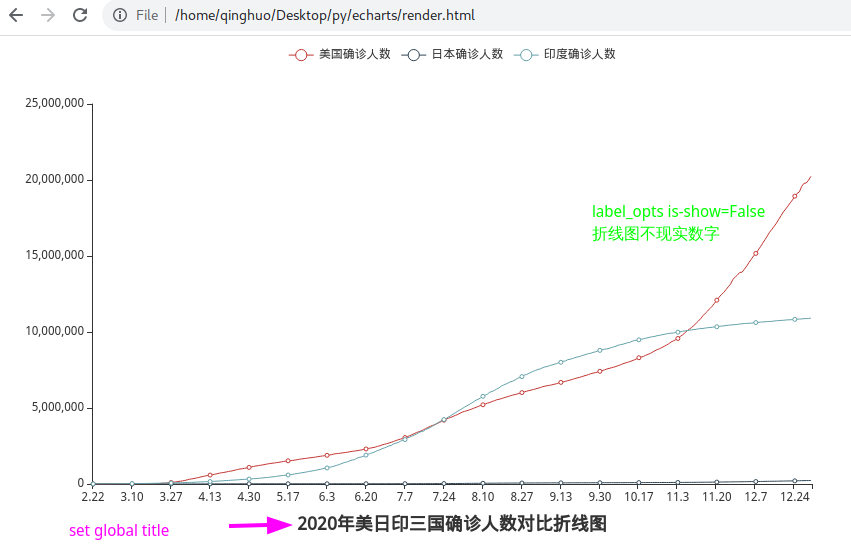
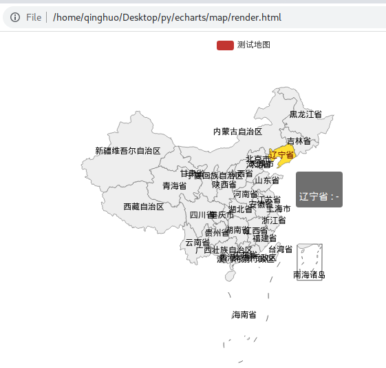
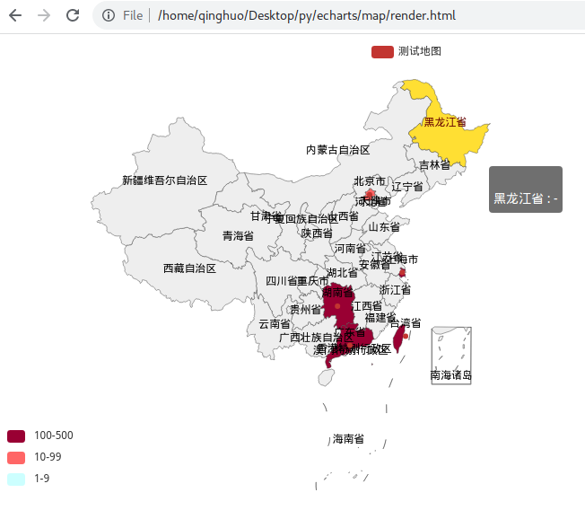
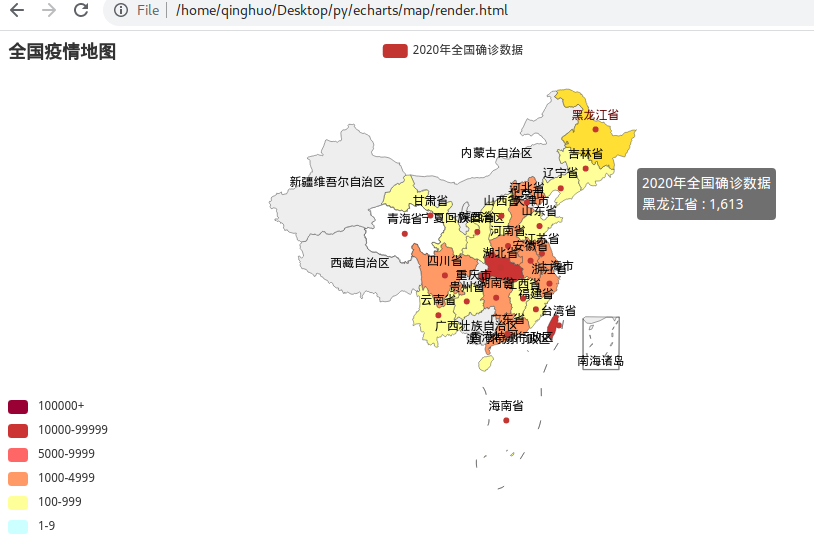
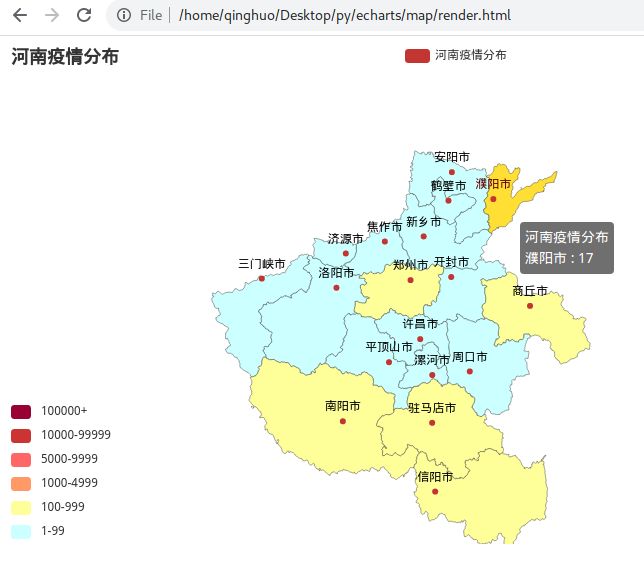
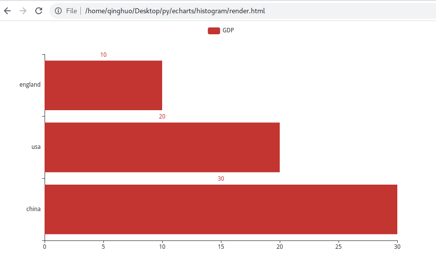
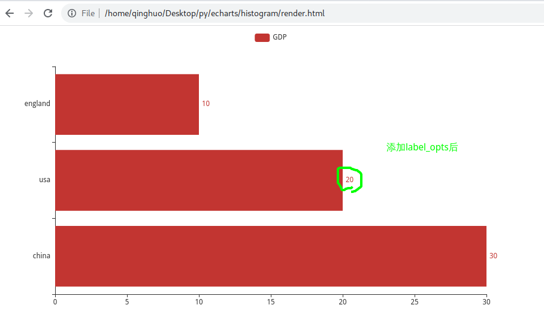
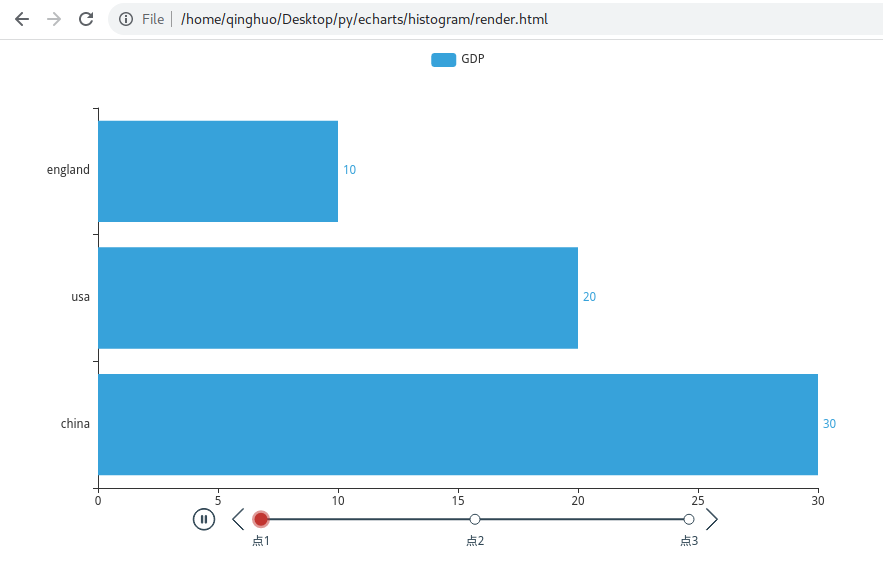
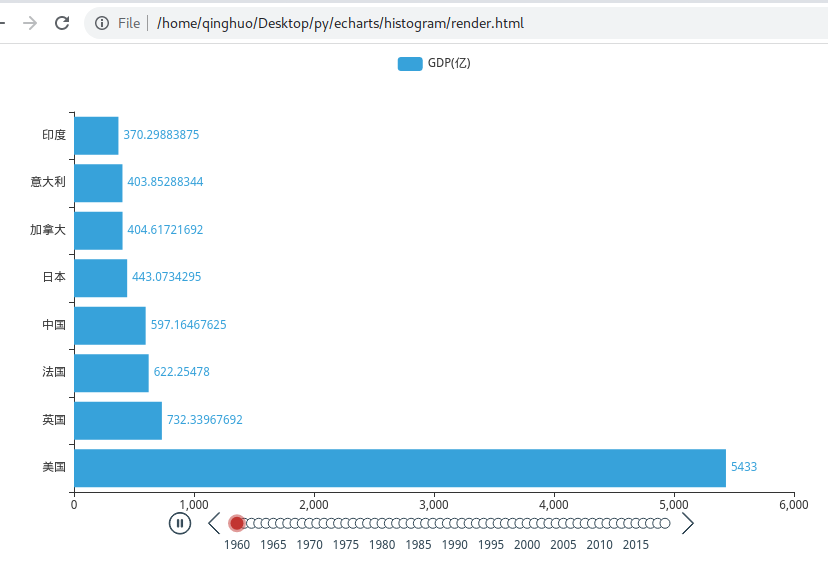
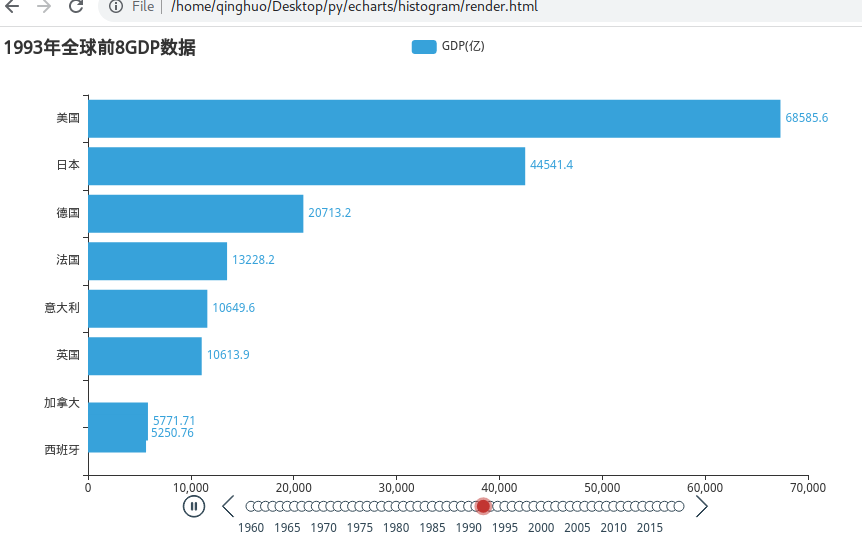

## pyecharts

如果想要做出数据可视化效果图，可以借助pyecharts模块完成

[pytecharts画廊链接](https://gallery.pyecharts.org)

#### 折线图

```py
#导入Line功能构建折线图对象
from pyecharts.charts import Line

#得到折线图对象
line = Line()

#添加x轴数据
line.add_xaxis(["China","USA","England"])

#添加y轴数据
line.add_yaxis("GDP",[30,20,10])

#设置全局配置项
line.set_global_opts(
    title_opts = TitleOpts(title="GDP展示",pos_left="center",pos_bottom="1%"),
    legend_opts = LegendOpts(is_show=True),
    toolbox_opts = ToolboxOpts(is_show=True),   #工具箱(右上)
    visualmap_opts = VisualMapOpts(is_show=True)    #视觉显示(左下)
)

#生成图表,运行成功后，会在./下出现html文件
line.render()
```
- 未使用```set_global_opts```全局配置前的折线图


- 使用```set_global_opts```全局配置后的折线图


#### 确诊折线图

```python 
import json
from pyecharts.charts import Line
#引入标题TitleOpts,关闭折线图默认显示的数字LabelOpts
from pyecharts.options import TitleOpts,LabelOpts

#此处折线图数据位置 ./material_py/line_chart/*
f_us = open("/home/qinghuo/Desktop/py/echarts/material/line_chart/USA.txt","r")
us_data = f_us.read()
f_jp = open("/home/qinghuo/Desktop/py/echarts/material/line_chart/Japan.txt","r")
jp_data = f_jp.read()
f_id = open("/home/qinghuo/Desktop/py/echarts/material/line_chart/India.txt","r")
id_data = f_id.read()

s = "jsonp_1629344292311_69436("
s_jp = "jsonp_1629350871167_29498("
s_id = "jsonp_1629350745930_63180("

# 去掉不规范开头/结尾
us_data = us_data.replace(s,"")
us_data = us_data[:-2]

jp_data = jp_data.replace(s_jp,"")
jp_data = jp_data[:-2]

id_data = id_data.replace(s_id,"")
id_data = id_data[:-2]

#将JSON转Python字典
us_dict = json.loads(us_data)
jp_dict = json.loads(jp_data)
id_dict = json.loads(id_data)

# 获取原数据中的trend (key)
us_trend_data = us_dict['data'][0]["trend"]
jp_trend_data = jp_dict['data'][0]["trend"]
id_trend_data = id_dict['data'][0]["trend"]

#获取日期数据，用于x轴，取到2020年(到314下标结束)
us_x_data = us_trend_data['updateDate'][:314]
#由于x轴的数据未日期，所以不需要下面2行
# jp_x_data = jp_trend_data['updateDate'][:314]
# id_x_data = id_trend_data['updateDate'][:314]

#获取确诊数据，用于y轴，取到2020年(到314下标结束)
us_y_data = us_trend_data['list'][0]["data"][:314]
id_y_data = id_trend_data['list'][0]["data"][:314]
jp_y_data = jp_trend_data['list'][0]["data"][:314]

#生成图表
line = Line()

#添加x轴数据
line.add_xaxis(us_x_data)

#添加y轴数据,下3行注释部分为最基础的图表
# line.add_yaxis("美国确诊人数",us_y_data)
# line.add_yaxis("日本确诊人数",jp_y_data)
# line.add_yaxis("印度确诊人数",id_y_data)
#添加y轴数据,下3行中label_opts的作用是为了取消默认现实折线上的数字
line.add_yaxis("美国确诊人数",us_y_data,label_opts=LabelOpts(is_show=False))
line.add_yaxis("日本确诊人数",jp_y_data,label_opts=LabelOpts(is_show=False))
line.add_yaxis("印度确诊人数",id_y_data,label_opts=LabelOpts(is_show=False))


# 设置全局配置项
line.set_global_opts(
    #标题设置
    title_opts = TitleOpts(title="2020年美日印三国确诊人数对比折线图",pos_left="center",pos_bottom="1%")
)

#渲染
line.render()

#关闭文件对象
f_us.close()
f_id.close()
f_jp.close()
```

- 未写入全局配置前的图表

- 写入全局配置后的图表,(增加了标题，关闭了折线图默认显示的数据)


## 地图可视化

```python
from pyecharts.charts import Map
from pyecharts.options import VisualMapOpts

# 准备地图对象
map = Map()

# 准备数据,若不填省市，会有不着色的bug
data = [
    ("北京市", 99),
    ("上海市", 199),
    ("湖南省", 299),
    ("台湾省", 399),
    ("广东省", 499)
]
# 添加数据
map.add("测试地图", data, "china")

# 设置全局选项
map.set_global_opts(
    #visualmap_opts为可视化地图的相关设置
    visualmap_opts=VisualMapOpts(
        is_show=True,
        #开启手动校准图片坐角配色块的范围
        is_piecewise=True,
        #具体的范围
        pieces=[
            {"min": 1, "max": 9, "label": "1-9", "color": "#CCFFFF"},
            {"min": 10, "max": 99, "label": "10-99", "color": "#FF6666"},
            {"min": 100, "max": 500, "label": "100-500", "color": "#990033"}
        ]
    )
)
# 绘图
map.render()
```

- data中未填写省市(未配置前)的地图

- 未配置前的地图

- 配置后的地图



#### 全国疫情可视化

```python
import json
from pyecharts.charts import Map
from pyecharts.options import VisualMapOpts,TitleOpts

# 读取数据文件
f = open("../material/map/ormicron.txt","r")
data = f.read()
# 关闭文件
f.close()

# 取到省级数据(将json转为dict)
data_dict = json.loads(data)
province_data_list = data_dict["areaTree"][0]["children"]
data_list = []
for province_data in province_data_list:
    #向列表中添加元组，依次为省份名称和总人数
    data_list.append((province_data["name"]+"省",province_data["total"]["confirm"]))
    #下行注释的原因：在测试中，如果不添加”省“这个字不报错，但无法正常显示
    # data_list.append((province_data["name"],province_data["total"]["confirm"]))

# 创建地图对象
map = Map()

# 添加数据
map.add("2020年全国确诊数据",data_list,"china")

# 设置全局配置定制分段的视觉映射
map.set_global_opts(
    title_opts=TitleOpts(title="全国疫情地图"),
    visualmap_opts=VisualMapOpts(
        is_show=True,
        is_piecewise=True,
        pieces=[
            {"min":1,"max":9,"label":"1-9","color":"#CCFFFF"},
            {"min":100,"max":999,"label":"100-999","color":"#FFFF99"},
            {"min":1000,"max":4999,"label":"1000-4999","color":"#FF9966"},
            {"min":5000,"max":9999,"label":"5000-9999","color":"#FF6666"},
            {"min":10000,"max":99999,"label":"10000-99999","color":"#CC3333"},
            {"min":100000,"label":"100000+","color":"#990033"},
        ]
    )
)
# 绘图
map.render()
```
- 全国范围确诊展示(无颜色的地方对应上述代码中的”省“)


#### 省级地图展示

```python
import json
from pyecharts.charts import Map
from pyecharts.options import VisualMapOpts,TitleOpts

# 读取数据文件
f = open("../material/map/ormicron.txt","r")
data = f.read()
# 关闭文件
f.close()

# 取到省级数据(将json转为dict)
data_dict = json.loads(data)
province_data_list = data_dict["areaTree"][0]["children"]
data_list = []
for province_data in province_data_list:
    #向列表中添加元组，依次为省份名称和总人数
    if province_data["name"] == "河南":
        for city in province_data["children"]:
            city["name"]
            #此处的 市 是必须加的，不然无法显示
            data_list.append((city["name"]+"市",city["total"]["confirm"]))
        break

# print(data_list)
data_list.append(("济源市",5))
# 创建地图对象
map = Map()

# 添加数据
map.add("河南疫情分布",data_list,"河南")

# 设置全局配置定制分段的视觉映射
map.set_global_opts(
    title_opts=TitleOpts(title="河南疫情分布"),
    visualmap_opts=VisualMapOpts(
        is_show=True,
        is_piecewise=True,
        pieces=[
            {"min":1,"max":99,"label":"1-99","color":"#CCFFFF"},
            {"min":100,"max":999,"label":"100-999","color":"#FFFF99"},
            {"min":1000,"max":4999,"label":"1000-4999","color":"#FF9966"},
            {"min":5000,"max":9999,"label":"5000-9999","color":"#FF6666"},
            {"min":10000,"max":99999,"label":"10000-99999","color":"#CC3333"},
            {"min":100000,"label":"100000+","color":"#990033"},
        ]
    )
)

# 绘图,render内可跟一个输出文件名
map.render()
```


## 柱状图

```python
from pyecharts.charts import Bar
from pyecharts.options import LabelOpts

# 使用Bar构建基础柱状图
bar = Bar()
# 添加x轴的数据
bar.add_xaxis(["china","usa","england"])
# 添加y轴的数据                 label_opts添加后的鲜果见下方第三幅图
bar.add_yaxis("GDP",[30,20,10],label_opts=LabelOpts(position="right"))
#翻转y轴
bar.reversal_axis()
# 绘图
bar.render()
```
- 基础(未翻转)

- 基础(翻转y轴)

- 基础(添加label_opts后的)


#### 时间线绘图

```python
from pyecharts.charts import Bar,Timeline
from pyecharts.options import LabelOpts
from pyecharts.globals import ThemeType

# 使用Bar构建基础柱状图 ,添加x轴的数据 ,添加y轴的数据
bar1 = Bar()
bar1.add_xaxis(["china","usa","england"])
bar1.add_yaxis("GDP",[30,20,10],label_opts=LabelOpts(position="right"))
bar1.reversal_axis()

bar2 = Bar()
bar2.add_xaxis(["china","usa","england"])
bar2.add_yaxis("GDP",[20,62,30],label_opts=LabelOpts(position="right"))
bar2.reversal_axis()

bar3 = Bar()
bar3.add_xaxis(["china","usa","england"])
bar3.add_yaxis("GDP",[70,50,40],label_opts=LabelOpts(position="right"))
bar3.reversal_axis()

# 构建时间线对象
# timeline = Timeline() 若不写入主题，则默认为红色
timeline = Timeline({"theme":ThemeType.LIGHT})

#在时间线内添加柱状图
timeline.add(bar1,"点1")
timeline.add(bar2,"点2")
timeline.add(bar3,"点3")

# 设置自动播放
timeline.add_schema(
    play_interval=1000,
    is_timeline_show=True,
    is_auto_play=True,
    is_loop_play=True
)

#时间线绘图需要采用timeline
timeline.render()
```
- 基础时间线(未添加自动播放和主题)

- 时间线(添加了自动播放和主题)


#### GDP动态柱状图

```python
from pyecharts.charts import Bar,Timeline
from pyecharts.options import LabelOpts,TitleOpts
from pyecharts.globals import ThemeType
#由于1960-2019全球GDP数据.csv文件非utf-8编码，所以需要对应编码打开(GB2312)
f = open("../material/GDP/1960-2019全球GDP数据.csv","r",encoding="GB2312")
#以列表形式读取全部数据
f_data_list = f.readlines()
f.close()
#删除第一行，第一行不是绘图需要的数据
f_data_list.pop(0)

# 将从文件读取来的数据转换为字典存储，格式为：
# { 年份: [ [国家, gdp], [国家,gdp], ......  ], 年份: [ [国家, gdp], [国家,gdp], ......  ], ...... }
# { 1960: [ [美国, 123], [中国,321], ......  ], 1961: [ [美国, 123], [中国,321], ......  ], ...... }
data_dict = {}

for s in f_data_list:
    line = s.split(",")
    year = int(line[0]) #获得年
    country = line[1]   #获得国家
    gdp = float(line[2])    #获得gdp数值
    data_ls = []
    data_ls.append([country,gdp])
    if not year in data_dict:
        data_dict[year] = data_ls
    else:
        data_dict[year].append([country,gdp])


#为了升序制作动态柱状图，取得字典的全部key作为list
data_list = data_dict.keys()

# 构建柱状图
timeline = Timeline({"theme":ThemeType.LIGHT})

for d in data_list:
    #得到年份对应的全部国家
    all_ls = data_dict[d]
    #根据gdp对国降序排列
    eight_ls = sorted(all_ls,key=lambda x: x[1],reverse=True)
    country_ls = []
    gdp_ls = []
    #取出降序后的前8个国家和GDP,国家和GDP各为一个list
    for i in range(8):
        country_ls.append(eight_ls[i][0])
        gdp_ls.append(eight_ls[i][1]/100000000) #这里除以亿和展示单位相关

    # 使用Bar构建基础柱状图
    bar = Bar()
    # 这里翻转两个存储国家和GDP列表的数据是为了后续展示，详情见图片
    country_ls.reverse()    # (1)
    gdp_ls.reverse()        # (1)
    # 添加x,y轴的数据
    bar.add_xaxis(country_ls)
    bar.add_yaxis("GDP(亿)",gdp_ls,label_opts=LabelOpts(position="right"))
    #翻转y轴
    bar.reversal_axis()
    bar.set_global_opts(
        title_opts=TitleOpts(title=f"{d}年全球前8GDP数据")
    )
    #在时间线内添加柱状图,示例代码中展示年份的“d”转为了str,此处未转str
    timeline.add(bar,d)

#设置时间线自动播放
timeline.add_schema(
    play_interval=1000,
    is_timeline_show=True,
    is_auto_play=True,
    is_loop_play=True
)

timeline.render()
```
- 未翻转前8名list前(对应上面代码的(1)处)的效果

- 翻转前8名list后(对应上面代码的(1)处)的效果


