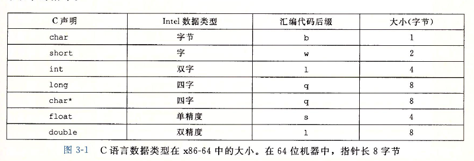
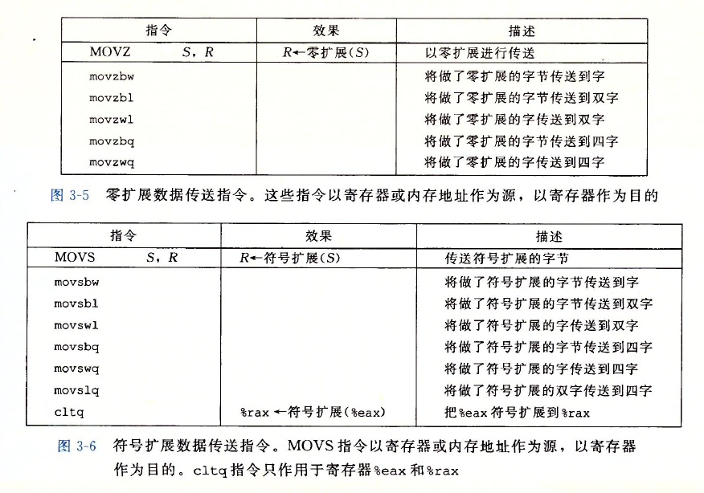

# AT&T 汇编

由于从 16 位体系扩展成 32 位，Intel 用术语 `字(word)` 表示 16 位数据类型。

 

## mov 格式

大多数 GCC 生成的汇编指令都有一个*字符的后缀* ,*表明操作数的的大小* 

| 指令   | 含义    |
|:---------------: | :---------------: |
|  movb  |  传送字节  |
|  movw  |  传送字  |
|  movl  |  传送双字  |
|  movq  |  传送四字  |

其中 movl 中的 *l*  的含义为 *long word* 

***

mov 指令的两类如下

 
