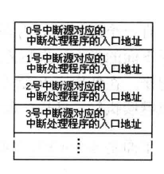

# 内中断

任何一种 CPU 都具备一种能力，可以```在执行完当前正在执行的指令之后，检测到从 CPU 外部发送过来的或内部产生的一种特殊信息，并且可以立即对所接受到的信息进行处理```。这种特殊的信息，一般称为```中断信息```。中断的意思是指：*CPU 不再接着(刚执行完的指令)向下执行，而是转去处理这个特殊信息* 

>通知信息 这里的中断信息，是为了便于理解采用的一种逻辑上的说法。它是对几个具有先后顺序的硬件操作所产生的事件的统一描述。中断信息是要求 CPU 马上进行某种处理，并想所要进行的该种处理提供了必备的通知信息

## 内中断的产生

当 CPU 的内部有什么事情发生的时候，将产生需要马上处理的中断信息。对于 8086CPU，当 CPU 内部有下面的情况发生的时候，将产生相应的的中断信息

1. 除法错误，eg：执行 div 产生的除法溢出
2. 单步执行
3. 执行 into 指令
4. 执行 int 指令

这 4 种是不同的信息,需要进行不同的处理。CPU 首先要知道，所接收到的中断信息的来源。所以中断信息中必须```包含识别来源的编码```。8086CPU 用称为 ```中断类型码```的数据来标识中断信息的来源。中断类型码为一个字节行数据，可以标识 256 种中断信息的来源。以后，我们将产生中断信息的事件、即中断信息的来源，简称为```中断源```。以上 4 种中断源，在 8086CPU 中的中断类型码如下：

1. 除法错误：0
2. 单步执行：1
3. 执行 into 指令：4
4. 执行 int 指令，该指令的格式为 int n,指令中的 n 为字节型立即数,是提供给 CPU 的中断类型码

## 中断处理程序

CPU 收到中断信息后，需要对中断信息进行处理。而如何对中断信息进行处理，可以由开发者决定。用来处理中断信息的程序被称为```中断处理程序```,一般来说，需要对不同的中断信息编写不同的处理程序

CPU 在收到中断信息后，应该转去执行该中断信息的处理程序。若要 8086CPU 执行某处的程序，就要将 CS:IP 指向它的入口(即程序第一条指令的地址)。可见，首要问题是，CPU 在收到中断信息后，如何根据中断信息确定其处理程序的入口

CPU 的设计者必须在中断信息和其处理程序的入口地址之间建立某种联系，使得 CPU 根据中断信息可以找到要执行的处理程序

中断信息中包含识别中断源的类型码。根据 CPU 的设计，中断类型码的作用就是用来定位中断处理程序。比如 CPU 根据中断类型码 4,就可以找到 4 号中断的处理程序。而若要定位中断处理程序，需要知道它的段地址和偏移地址，如果根据 8 位的中断类型码得到中断处理程序的段地址和偏移地址呢？

## 中断向量表

CPU 用 8 位的中断类型码通过中断向量表找到相应的中断处理程序的入口地址。那么什么是中断向量表呢？

```中断向量表就是中断向量的列表```。那么什么又是中断向量呢？其实就是```中断处理程序的入口地址```。

中断向量表，就是中断处理程序入口地址的列表

中断向量表在内存中保存，其中存放着 256 个中断源所对应的中断处理程序的入口，如下图



CPU 只要知道了中断类型码，就可以将中断类型码作为中断向量表的下标，定位相应的表项,从而得到中断处理程序的入口地址

CPU 用中断类型码，通过查找中断向量表，就可以得到中断处理程序的入口地址。在这个方案中，一个首要问题是，CPU 如何找到中断向量表？现在，找到中断向量表成了通过中断类型码找到中断处理程序入口地址的先决条件

中断向量表在内存中存放，对于 8086CPU，中断向量表指令放在内存地址 0 处。从内存 0000:0000 到 0000:03FF 的1024 个单元中存放着中断向量表。

能不能放在别处呢？并不能！！！如果使用 8086CPU，中断向量表就必须放在 0000:0000~0000:03FF 单元中，这是规定，规定了 8086CPU 就从这个地方读取中断向量表

那么在中断向量表中，一个表项占多达的空间呢？一个表项存放一个中断向量，即一个中断处理成工序的入口地址。对于 8086CPU ，这个入口地址包括段地址和偏移地址，所以```一个表项占两个字，高地址字存放段地址，低地址字存放偏移地址```

## 中断过程

从上面可以看出，可以用中断类型码，在中断向量表中找到中断处理程序的入口。

